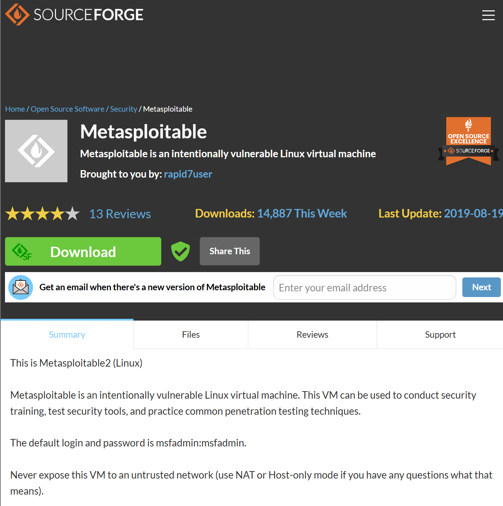
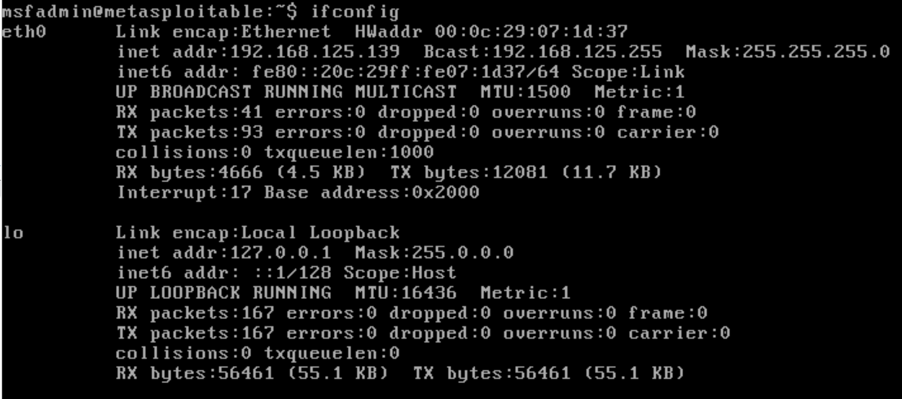
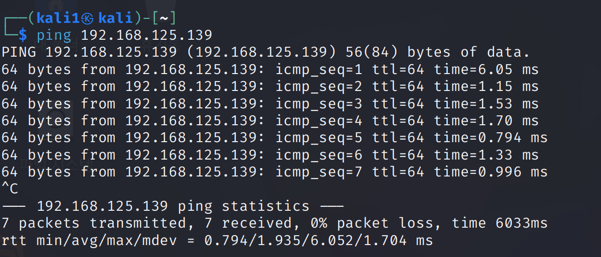
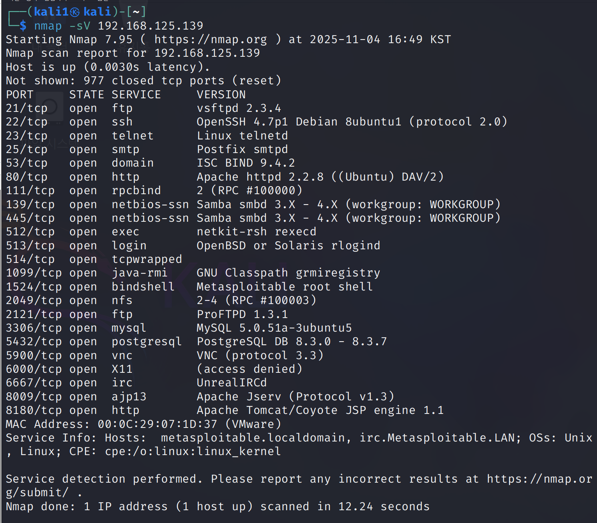
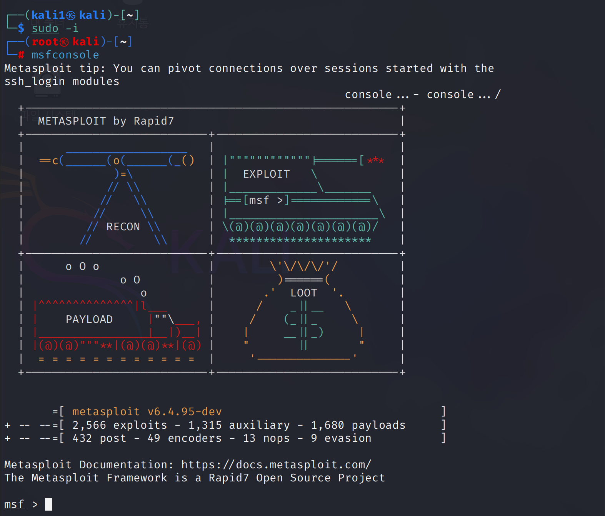

# metasploitable 실습 환경 구성

### 실행 환경
- 공격 대상 서버 : metasploitable2
- 공격자 서버 : kali linux (2025.1c)
- 사용 가상머신 : Vmare 

### Metasploitable 
- Metasploitable은 의도적으로 취약하게 구성된 가상머신으로 펜테스트 도구나 취약점 분석 연습용 타깃 대상으로 사용됩니다.


<br>

### Metasploitable 다운  
- 링크 : https://sourceforge.net/projects/metasploitable/  

<br>



Metasploitable2 다운로드 화면.  
다운로드 이후  압축해제를 해줍니다.  

Vmare에서 `Open a Virtual Machine` 선택 후 `Metasploitable` 파일 열어주면 아래 로그인 페이지가 뜹니다.    

<br>


**초기 비밀번호**
```
id : msfadmin
pw : msfadmin
```




로그인 이후 `ifnonfig` 명령어를 입력해준 뒤 앞으로 사용하게 될 Metasploitable VM의 IP 주소를 기억해줍시다.   

```
192.168.125.139
```

<br>



kali linux 에서 해당 주소로 ping 을 보내보면 보내지는 것을 확인할 수 있습니다.    


<br>



nmap 을 통해 metasploitable에 열려있는 포트를 전부 확인해볼 수도 있습니다.   

<br>

이제 실습용 환경을 만들기 위하여 kali linux에 `metasploit framework`를 다운 받아줍시다.  

보통 설치가 되어있으나 설치가 되어있지 않다면 아래 순서를 따라서 간단하게 설치를 하면됩니다.  


**실습용 환경 구성 단계**
```bash
sudo apt update
sudo apt install -y metasploit-framework
```
우선 metasploit framework를 다운받아줍니다.   


```bash
sudo msfdb init
```
데이터베이스에 사용자 계정을 생성하고 metasploit 와 연결합니다.   

```bash
sudo -i
```
root 쉘로 들어간 후,   


```bash
msfconsole
```
해당 명령어로 metasploit 콘솔을 열어주면 됩니다.  

<br>



<br>
앞으로의 실습은 kali linux VM 에서 진행되며, 실습 전 metasploitable VM 을 공격 대상 서버라 생각하고 진행할 예정입니다.    

공격 코드는 msfconsole을 활용하며 사용법은 아래와 같습니다.  

1. `search [키워드1] [키워드2 (필요시)] [키워드 N (필요시)]` 명령어로 실습해볼 모듈을 찾기.  

2. 해당 키워드와 관련된 모듈이 결과로 나오고, index에 맞는 번호에 `use [index]`를 입력하기.

3. `set rhost [ip 주소]` 로 대상 서버를 지정.   

4. `run` 명령어로 실행. 


해당 모듈은 아래에서 자세히 확인해볼 수 있습니다.  
- https://github.com/rapid7/metasploit-framework/tree/master/modules/auxiliary


