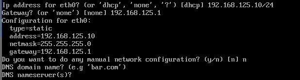
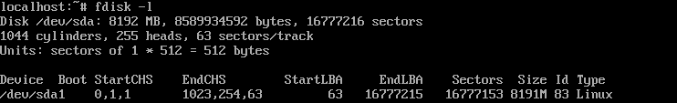
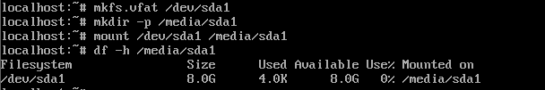
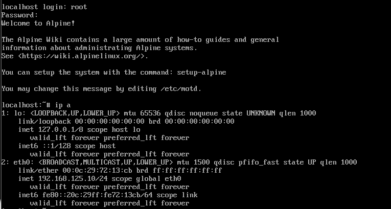
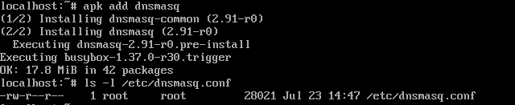
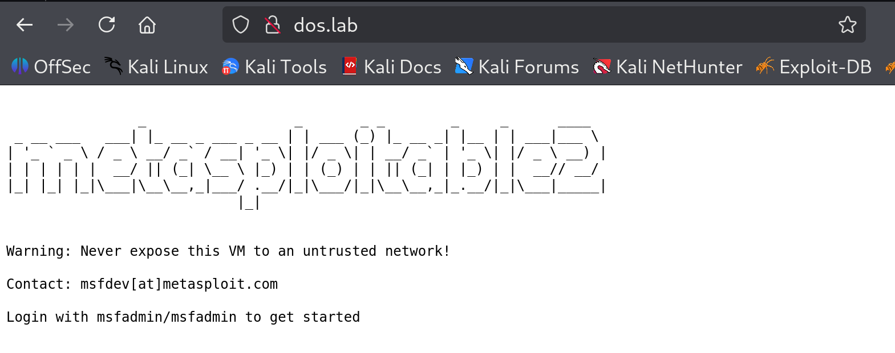

# Alpine DNS 서버 세팅

### 실습 환경의 제약 명시 & 보완   

이번 실습 환경의 경우 DNS Query Flood의 동작 원리를 관찰하는 것이 목표이기 때문에 아래와 같이 설계하였습니다.  

- 별도의 Recursive Resolver 서버가 존재하지 않습니다. 
- DNS 서버는 DMZ 구역에 존재하는 것이 아닌 외부망에 존재합니다. 
- 루트 서버, TLD 서버와 같이 공개 DNS 계층이 분리되어 여러 서버로 존재하지 않습니다.  

<br>

이러한 제약은 실제 인터넷 환경과 차이가 있지만,  
다음과 같은 설계로 보완하였습니다.  
<br>

**1. 별도의 Resolver 서버가 없는 구조 보완**

현실적인 DNS 환경에서는 Client - Recursive Resolver - 루트/TLD/권한 서버로의 질의가 단계적으로 전달됩니다.  

이번 실습에서는 하나의 DNS 서버(하나의 Alpine DNS 서버)가 리졸버의 역할도 함께한다고 가정하겠습니다. 논리적으로는 다른 서버로 나누어질 수 있도록 다른 ip를 부여할 예정입니다.  

공격자의 입장에서 리졸버를 거쳐서 공격을 할지, 직접 권한 서버를 공격할 지(Direct Query Flood)에 따라 전략이 달라지겠지만, 이번 실습에서는 NXDOMAIN Flood를 실습할 예정입니다. 따라서 리졸버를 거치는 방법이 더욱 일반적입니다.  

또한 이러한 방법을 사용하면 DNS 서버가 일정 시간동안 응답을 기다리며 슬롯을 점유하는 상황이 재현 가능하며, 실제 처리 흐름을 따라가는 것이 가능합니다.  

<br>

**2. DNS 서버가 DMZ 구역이 아닌 외부에 존재하는 구조**  

실제 공격 대상은 주로 DMZ 구역에 위치하는 권한 DNS 서버이지만

이번 실습에서는 DNS 서버의 위치를 주요 변수로 두지 않고, DNS 서버 내부의 자원 소모가 핵심이기 때문에 서버의 위치는 외부에 존재한다고 가정하였습니다.  

<br>

**3. 루트/TLD/권한 서버를 실제로 분리하여 구성하지 않은 문제점 보완**  

실제 DNS 환경에서는 NXDOMAIN 응답을 생성하기 위해 루트 - TLD - 권한 서버로 이어지는 질의가 발생합니다. 이때 각 서버는 별도로 이루어져있으며, 그에 따른 지연시간이 발생합니다.  

이번 실습에서는 DNS 서버가 다른 DNS 계층으로 질의한다고 가정할 것입니다.  
비록 단일 DNS 서버에서 질의를 처리하지만 여러 DNS 서버가 가정하고, 그 과정에서 발생하는 대기 시간을 인위적으로 재현할 것 입니다.  

구체적으로 다음과 같이 보완할 예정입니다.  

- 동일한 DNS 서버(하나의 Alpine DNS 서버) 내에서 루트/TLD/권한 서버 각각 다른 ip를 부여합니다.  
- 다시 말해 서로 다른 ip 주소를 upstream DNS 서버로 설정합니다. 
- 각 ip에 대해 질의/응답에는 인위적으로 지연시간을 부여합니다. 
- 그 시간 동안 DNS 서버가 질의를 처리 중인 상태로 유지되도록 구성합니다.  

이렇게 DNS 서버가 논리적으로 다른 DNS 서버에 질의 중인 상태를 만들어 둘 예정입니다.  


<br>


### 목표 상황 (예시)

위 구조는 DNS Query Flooding 을 위한 예시이며,  
DNS Reflection Attack에서의 구조와는 차이가 있습니다.

```
     kali (공격자) 
          |
     DNS Resolver
    192.168.125.10
          |
          |
          |     <----> Root (192.168.125.20)
          |
          |     <----> TLD (192.168.125.30)
          |
          |     <----> Auth (192.168.125.40)
          |
          |
     kali (공격자) 
          |
          |
          |   ip 주소 : 192.168.125.145
  openwrt (라우터/방화벽)
          |   ip 주소 : 192.168.1.1
        (LAN)
          |   ip 주소 : 192.168.1.22
    metasploitable2 

```

<br>

### DNS 서버 구성 - Alpine Linux 세팅

이번 실습에서는 dns 서버를 활용할 예정이므로, 간단한 DNS 서버를 Alpine 리눅스를 활용하여 만들어주겠습니다.    

- 다운 버전 : Alpine Extended Version 3.23.2 (Released Dec 17, 2025)

<br>

위 버전을 다운로드한 후 VMare에 올려주었습니다.  
login에서 비밀번호 입력없이 root만 입력하면 세팅화면으로 넘어가게 됩니다.  

고정 ip와 디스크 할당 외엔 대부분 엔터를 입력했습니다.  


```
setup-alpine
```

<br>

**고정 ip 할당**  


192.168.125.10으로 고정 ip를 할당해주었습니다.  


<br>

  

alpine 리눅스는 RAM 기반으로 동작해서 디스크를 사용하지 않습니다. 따라서 설정 환경을 지속적으로 쓰기 위해서는 별도의 디스크 설정을 해주어야합니다.   

또한 지금 환경에서는 네트워크에 연결시키지 않은 폐쇄환경이기 때문에 패키지 설치나 부트로더 구성을 위한 온라인 저장소를 사용할 수 없습니다. 따라서 위 사진에 보이는 저 8.6GB의 sda 디스크를 수동으로 설정을 저장하는 곳으로 사용하도록 설정하겠습니다.  

<br>



우선은 sda 디스크에 있는 파티션을 확인해봅니다.  
sda1 파티션이 있는 것을 알았습니다.  

<br>


이제 `/dev/sda1`을 포맷해주기 위해 포맷 도구를 사용해야하는데, mkfs가 있는지부터 확인해보았습니다.  
mkfs.vfat을 사용할 수 있는 걸 알았으니 sda1 파티션을 포맷해줍니다.    

<br>





이제 `/media/sda1` 디렉토리를 만들어주고, 아까 만들어둔 파일시스템을 해당 경로에 마운트 해주면 됩니다.  

```sh
$ mkfs.vfat /dev/sda1
$ mkdir -p /media/sda1
$ mount /dev/sda1 /media/sda1
```

`/media/sda1`가 잘 붙었는지 확인은 `df -h` 명령어로 확인이 가능합니다.  

<br>

이제 sda1을 백업 저장소처럼 사용할 것이므로 백업 저장소로 지정을 해주고,  
DNS 설정파일에 적힌 값도 확인해보고 변경사항을 하드 디스크에 저장해줍니다.  

```sh
$ setup-lbu sda1
$ vi /etc/resolv.conf
$ lbu commit -d
```
<br>

현재 alpine linux는 RAM에서만 돌아가기 때문에 현재의 설정들을 `/media/sda1`에 `localhost.apkovl.tar.gz` 로 저장하는 것입니다. 위 방법을 통해 다음 부팅 때에도 자동으로 설정을 복구할 수 있게 됩니다.  

<br>

  

`ls -l /media/sda1`를 통해 해당 압축파일이 생겼는지 확인해볼 수 있습니다.  


<br>



```sh
reboot
```

실제로 reboot을 해본 뒤 설정을 확인해봐도 초기화가 되지 않은 것을 확인할 수 있습니다.  

<br>

### alpine 세팅



```sh
apk add dnsmasq
```

```
ls -l /etc/dnsmasq.conf
```

먼저 dns 세팅을 위한 툴을 설치해줍니다.  
그러면 `/etc/dnsmasq.conf`라는 파일이 생기게 되는데, 해당 파일에 아래 줄을 추가해주면 됩니다.  

```conf
port=53
listen-address=192.168.125.10
cache-size=0
dns-forward-max=20
dns-queue-size=20
edns-packet-max=512
retry-time=1

log-queries
log-facility=/var/log/dnsmasq.log

address=/dos.lab/192.168.125.145
```

<br>


이제 로그가 적힐 로그파일을 만들어주고,  

```sh
touch /var/log/dnsmasq.log
chmod 644 /var/log/dnsmasq.log
```

실행시켜줍니다.  
부팅 시에 자동실행도 설정해두었습니다.  
```sh
rc-service dnsmasq start
rc-update add dnsmasq default
```

  

이렇게 리슨 상태까지 확인이 끝났습니다.   


로그는 아래처럼 확인이 가능합니다.  

```sh
tail -f /var/log/dnsmasq.log
```


<br>

### kali 세팅

실습용으로 특정 주소에만 접근할 예정이므로 kali의 dns 서버를 바꿔줍시다.  
`/etc/resolv.conf` 파일에서 dns 서버를 `192.168.125.10` 로 변경해주면 됩니다.  


```
nameserver 192.168.125.10
```


<br>

그리고 firefox에서 hsts 설정 때문에 `http://dos.lab`으로 들어가도 https가 되어버려서, firefox의 설정부터 바꾸어주었습니다. about:config 를 검색창에 입력하여 들어갈 수 있습니다.  

단순히 https-only 옵션을 꺼도 안되길래 https-first 옵션도 전부 꺼봤습니다.  
그래도 여전히 안되어서 부가동작과 sync 관련 설정까지 전부 꺼보았더니 잘 되었습니다.  

아래는 false로 바꾼 옵션들목록입니다.  

```
dom.security.https_only_mode                    = false
dom.security.https_only_mode_pbm                = false
dom.security.https_only_mode_ever_enabled       = false
dom.security.https_only_mode_ever_enabled_pbm   = false

dom.security.https_first                        = false
dom.security.https_first_schemeless             = false
dom.security.https_first_pbm                    = false
dom.security.https_first_add_exception_on_failure = false

dom.security.https_only_mode_error_page_user_suggestions         = false

services.sync.prefs.sync.dom.security.https_only_mode                  = false
services.sync.prefs.sync.dom.security.https_only_mode_pbm              = false
services.sync.prefs.sync.dom.security.https_only_mode_ever_enabled     = false
services.sync.prefs.sync.dom.security.https_only_mode_ever_enabled_pbm = false
```




  

이렇게 dos.lab 주소로 잘 들어가지는 것을 볼 수 있습니다.  

Alpine 에서는 설정이 끝나면 저장을 해주어야하므로 커밋을 해주면 설정이 끝이납니다.  

```sh
lbu commit -d
```


<br>
<br>


### Reference  
- alpine linux download : https://www.alpinelinux.org/downloads/
- https only mode : https://support.mozilla.org/ko/kb/https-only-prefs
- hsts : https://en.wikipedia.org/wiki/HTTP_Strict_Transport_Security
- hsts Q&A: 
  - https://support.mozilla.org/ko/questions/919498  
  - https://support.mozilla.org/ko/questions/1343377
  - https://support.mozilla.org/ko/questions/942924
- How to clear HSTS settings in Firefox : https://www.thesslstore.com/blog/clear-hsts-settings-chrome-firefox/