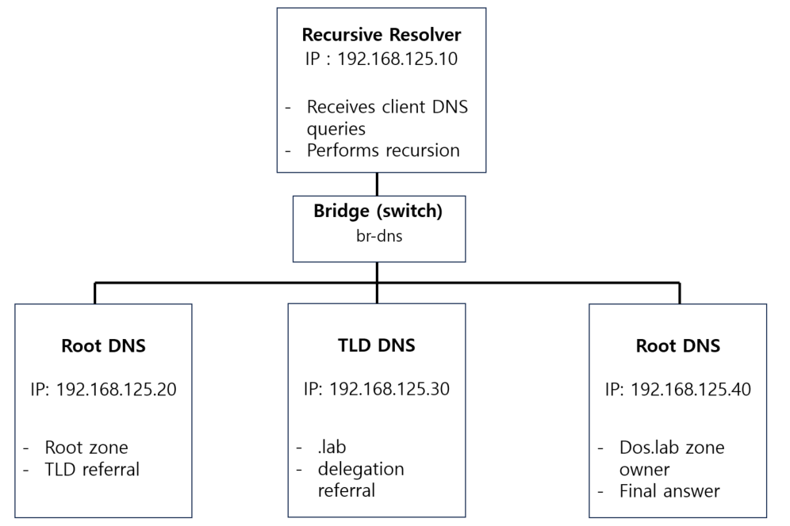
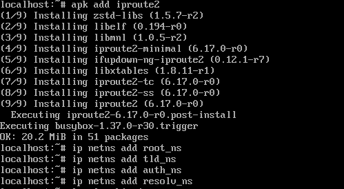
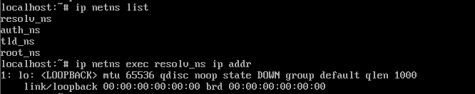
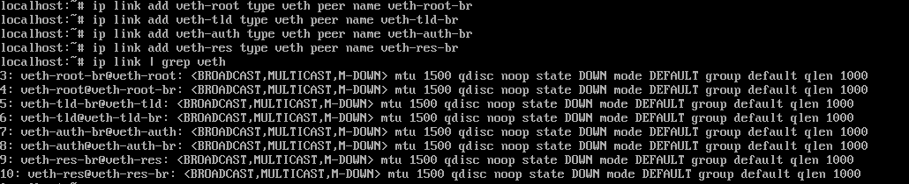
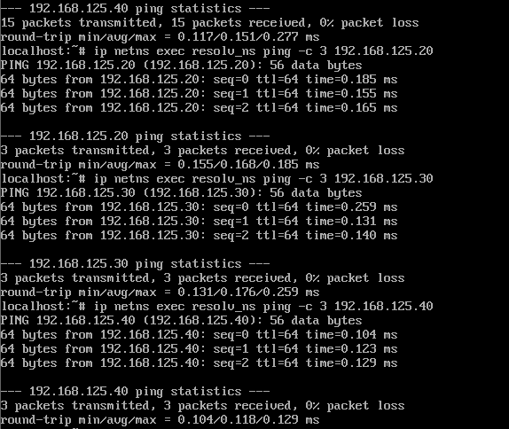

# NXDOMAIN Flood  


### 실험 목적   
이번 실습에서는 존재하지 않는 도메인에 대해(NXDOMAIN) 질의가 증가할 때 발생하는 지연을 관측하는 것입니다.   

<br>

### 실습 환경의 제약 명시 & 보완   

이번 실습 환경의 경우 DNS Query Flood의 동작 원리를 관찰하는 것이 목표이기 때문에 아래와 같이 설계하였습니다.  

- 별도의 Recursive Resolver 서버가 존재하지 않습니다. 
- DNS 서버는 DMZ 구역에 존재하는 것이 아닌 외부망에 존재합니다. 
- 루트 서버, TLD 서버와 같이 공개 DNS 계층이 분리되어 여러 서버로 존재하지 않습니다.  

<br>

이러한 제약은 실제 인터넷 환경과 차이가 있지만,  
다음과 같은 설계로 보완하였습니다.  
<br>

**1. 별도의 Resolver 서버가 없는 구조 보완**

현실적인 DNS 환경에서는 Client - Recursive Resolver - 루트/TLD/권한 서버로의 질의가 단계적으로 전달됩니다.  

이번 실습에서는 하나의 DNS 서버(하나의 Alpine DNS 서버)가 리졸버의 역할도 함께한다고 가정하겠습니다. 논리적으로는 다른 서버로 나누어질 수 있도록 다른 ip를 부여할 예정입니다.  

공격자의 입장에서 리졸버를 거쳐서 공격을 할지, 직접 권한 서버를 공격할 지(Direct Query Flood)에 따라 전략이 달라지겠지만, 이번 실습에서는 NXDOMAIN Flood를 실습할 예정입니다. 따라서 리졸버를 거치는 방법이 더욱 일반적입니다.  

또한 이러한 방법을 사용하면 DNS 서버가 일정 시간동안 응답을 기다리며 슬롯을 점유하는 상황이 재현 가능하며, 실제 처리 흐름을 따라가는 것이 가능합니다.  

<br>

**2. DNS 서버가 DMZ 구역이 아닌 외부에 존재하는 구조**  

실제 공격 대상은 주로 DMZ 구역에 위치하는 권한 DNS 서버이지만  

이번 실습에서는 DNS 서버의 위치를 주요 변수로 두지 않고, DNS 서버 내부의 자원 소모가 핵심이기 때문에 서버의 위치는 외부에 존재한다고 가정하였습니다.  

<br>

**3. 루트/TLD/권한 서버를 실제로 분리하여 구성하지 않은 문제점 보완**  

실제 DNS 환경에서는 NXDOMAIN 응답을 생성하기 위해 루트 - TLD - 권한 서버로 이어지는 질의가 발생합니다. 이때 각 서버는 별도로 이루어져있으며, 그에 따른 지연시간이 발생합니다.  

이번 실습에서는 DNS 서버가 다른 DNS 계층으로 질의한다고 가정할 것입니다.  
비록 단일 DNS 서버에서 질의를 처리하지만 여러 DNS 서버가 가정하고, 그 과정에서 발생하는 대기 시간을 인위적으로 재현할 것 입니다.  

구체적으로 다음과 같이 보완할 예정입니다.  

- 동일한 DNS 서버(하나의 Alpine DNS 서버) 내에서 루트/TLD/권한 서버 각각 다른 ip를 부여합니다.  
- 다시 말해 서로 다른 ip 주소를 upstream DNS 서버로 설정합니다. 
- 각 ip에 대해 질의/응답에는 인위적으로 지연시간을 부여합니다. 
- 그 시간 동안 DNS 서버가 질의를 처리 중인 상태로 유지되도록 구성합니다.  

이렇게 DNS 서버가 논리적으로 다른 DNS 서버에 질의 중인 상태를 만들어 둘 예정입니다.  


<br>


### 목표 상황  

  

```
     kali (공격자) 
          |
     DNS Resolver
    192.168.125.10  
          |
          |     <----> Root (192.168.125.20)
          |
          |     <----> TLD (192.168.125.30)
          |
          |     <----> Auth (192.168.125.40)
          |
          |
     kali (공격자) 
          |
          |
          |   ip 주소 : 192.168.125.145
  openwrt (라우터/방화벽)
          |   ip 주소 : 192.168.1.1
        (LAN)
          |   ip 주소 : 192.168.1.22
    metasploitable2 

```


<br>


### 설계 방법  

- Recursive Resolver 서버는 외부에 노출될 것입니다. 즉 브라우저가 직접 질의하는 대상이 됩니다.  
- Root/TLD/Auth 는 Resolver만 접근하며 각 서버는 netns(Network Namespace)를 활용할 것입니다.  
- 그렇게 여러 네트워크 환경을 veth 페어로 설정하여 실제 서버간의 통신을 구현합니다.  


**netns 세팅**
``` 
netns root_ns        (192.168.125.20)
netns tld_ns        (192.168.125.30)
netns auth_ns       (192.168.125.40)
```


<br>
 
### 지연 설정 방법  

현실적인 NXDOMAIN 공격을 고려해보면, Root/TLD 정보는 이미 캐시되어 있을 것입니다. 따라서 실질적인 왕복 지연은 Recursive Resolver와 Authoritative DNS 사이에서 발생합니다.  

그러므로 Resolver–Authoritative 구간에만 약 20ms의 RTT를 발생시키고,  

NXDOMAIN 질의 증가 시 in-flight query 누적과 tail latency 증가가 자연스럽게 발생하도록 구성하겠습니다.  

<br>

### netns 기본 세팅  



*수정 : resolv-ns는 별도로 나누지 않습니다.*

우선 iproute2 를 설치해주어 netns 3개를 생성해줍니다.  
이름은 각각 `root_ns`, `tld_ns`, `auth_ns`로 설정해주었습니다.  

```bash
apk add iproute2
```

```bash
ip netns add root_ns
ip netns add tld_ns
ip netns add auth_ns
```

<br>

  

*수정 : resolv-ns는 별도로 나누지 않습니다.*

이렇게 잘 만들어졌는지 확인이 가능합니다.  

<br>


  

*수정 : resolv-ns는 별도로 나누지 않습니다.*

이제 veth 페어를 만들어줍시다.   


```bash
ip link add veth-root type veth peer name veth-root-br
ip link add veth-tld  type veth peer name veth-tld-br
ip link add veth-auth type veth peer name veth-auth-br
```
*수정 : resolv-ns는 별도로 나누지 않습니다.*

veth는 가상 랜선의 양 끝이라 생각하면 됩니다.  
`veth-root`는 `veth-root-br`에만 연결되어있으며 한 쌍으로 연결됩니다.  
즉 `veth-root`는 오로지 `veth-root-br`만을 사용하고 `veth-root-br`을 통해 통신합니다.  


<br>
<br>

이제 그렇게 `veth-root`과 같은 한쪽 끝을 네임스페이스로 옮겨줍니다. 아래 명령어를 치면 됩니다.  

```bash
ip link set veth-root netns root_ns
ip link set veth-tld  netns tld_ns
ip link set veth-auth netns auth_ns
```

이를 통해 veth 페어에서 한쪽 끝은 특정 네임스페이스로 옮겨준 것입니다.  
그럼 지금의 구조는 아래와 같습니다.   

```
root_ns: veth-root   <---랜선(케이블)--->   host: veth-root-br
```


<br>

veth 페어의 한쪽 끝을 각 namespace로 이동시켰으므로 각 namespace는 자신만의 네트워크 인터페이스(veth)를 가지게 됩니다.  

다음 명령어를 통해 각 namespace 내부의 veth 인터페이스에 ip 주소를 할당합니다.  


```bash
ip netns exec root_ns   ip addr add 192.168.125.20/24 dev veth-root
ip netns exec tld_ns    ip addr add 192.168.125.30/24 dev veth-tld
ip netns exec auth_ns   ip addr add 192.168.125.40/24 dev veth-auth
```

이 과정을 통해 각 namespace를 하나의 독립적인 서버처럼 사용하겠다는 의미입니다.  
이렇게 각 서버가 자신만의 ip 주소를 가지게 됩니다.  

<br>


네트워크 인터페이스는 기본적으로 비활성화(down) 상태일 수도 있으므로 활성화(up) 해준 단계입니다.  

```bash
ip netns exec root_ns   ip link set veth-root up
ip netns exec tld_ns    ip link set veth-tld up
ip netns exec auth_ns   ip link set veth-auth up
```
```bash
ip link set veth-root-br up
ip link set veth-tld-br  up
ip link set veth-auth-br up
```

<br>
<br>


veth는 일대일로 연결된 가상 랜선입니다.  
따라서 이렇게 만들어진 veth 인터페이스를 서로 연결해주는 장치가 필요합니다.  

따라서 실제 서버들처럼 통신하도록 보이기 위해 bridge를 생성해줬습니다.  


```bash
ip link add br-dns type bridge
ip link set br-dns up
```

여기의 br-dns 는 모든 veth 인터페이스를 연결하는 중앙 스위치 역할을 할 것입니다.  

<br>


이후 남아있는 veth 인터페이스를 br-dns에 연결해주면 됩니다.   


```bash
ip link set veth-root-br master br-dns
ip link set veth-tld-br  master br-dns
ip link set veth-auth-br master br-dns
```

<br>

이제 해당 브릿지가 resolver 서버를 통해 통신을 해야합니다.  
그러기 위해서 외부에서 들어오는 패킷을 resolver 서버에서 받아낼 수 있어야합니다.  

이러한 과정을 해결하기 위해 eth0 인터페이스를 br-dns로 흘러갈 수 있도록 만들어주었습니다.  

```bash
brctl addif br-dns eth0 2>/dev/null || ip link set eth0 master br-dns
```

eth0이 br-dns 의 멤버가 되도록 해주었습니다.  
최종적으로 ip a 를 통해 상태를 확인하면 아래와 같습니다.  


   

*수정 : resolv-ns는 별도로 나누지 않습니다. 기존 eth0 인터페이스에서 ping으로 확인해보면 됩니다.*  

이렇게 ping을 통해 각 서버와의 통신상태를 확인해보면, 전부 잘 되는 것을 볼 수 있습니다.  


이렇게 Alpine 서버 내에서 실제 DNS 서버와 비슷하게 구성을 마쳤습니다.    


<br>
<br>

### DNS 서버 설정  

이제 각 서버에 파일을 설정해줍시다.  
netns 로 네트워크를 분리했지만 dnsmasq.conf 를 공통으로 읽으므로 각자 읽을 파일을 새로 만들어줍니다.  

- `root_ns` -> `/etc/dnsmasq/root.conf`
- `tld_ns` -> `/etc/dnsmasq/tld.conf`
- `auth_ns` -> `/etc/dnsmasq/auth.conf`


위 구조로 만들었습니다.  

<br>

**Recursive Resolver (/etc/dnsmasq.conf)**  
```conf
port=53
bind-interfaces
interface=lo
listen-address=127.0.0.1,192.168.125.10

server=192.168.125.20
cache-size=0
no-poll

log-queries
log-facility=/var/log/dnsmasq.log
```

<br>


**Root DNS (/etc/dnsmasq/root.conf)**  
```conf
port=53
bind-interfaces
interface=veth-root
listen-address=192.168.125.20

no-resolv
no-hosts

server=/lab/192.168.125.30
```

<br>


**TLD DNS (/etc/dnsmasq/tld.conf)**  
```conf
port=53
bind-interfaces
interface=veth-tld
listen-address=192.168.125.30

no-resolv
no-hosts

server=/dos.lab/192.168.125.40
```

<br>

**Authoritative DNS (/etc/dnsmasq/auth.conf)**  
```conf
port=53
bind-interfaces
interface=veth-auth
listen-address=192.168.125.40

no-resolv
no-hosts

address=/dos.lab/192.168.125.145
local=/dos.lab/
```

<br>

파일을 저장해주었다면 이제 실행을 시켜줍시다.   


```bash
dnsmasq -C /etc/dnsmasq.conf
ip netns exec root_ns dnsmasq -C /etc/dnsmasq/root.conf
ip netns exec tld_ns dnsmasq -C /etc/dnsmasq/tld.conf
ip netns exec auth_ns dnsmasq -C /etc/dnsmasq/auth.conf
```

그리고 아래 명령어를 통해 로그를 확인해보면,  


```bash
tail -f /var/log/dnsmasq.log
```


이렇게 192.168.125.10 인 리졸버 서버에서 root 서버인 192.168.125.20 인 루트서버로 패킷이 흘러갑니다.  

