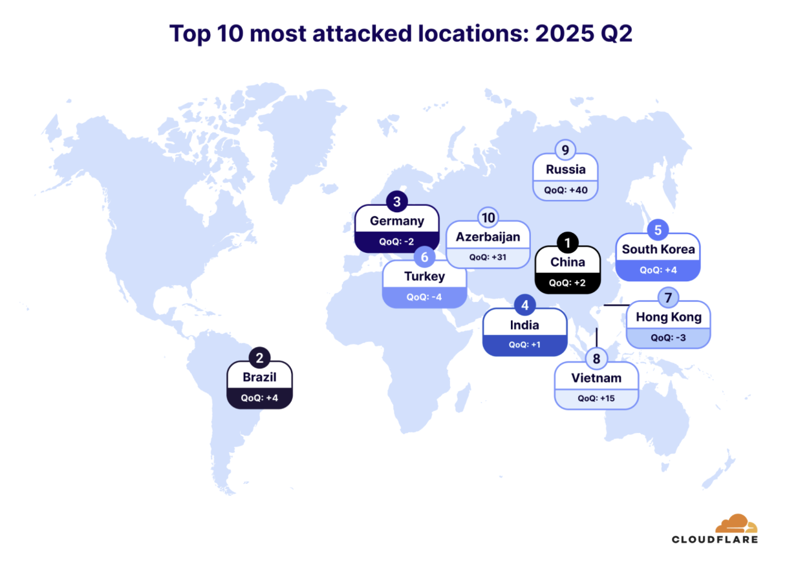
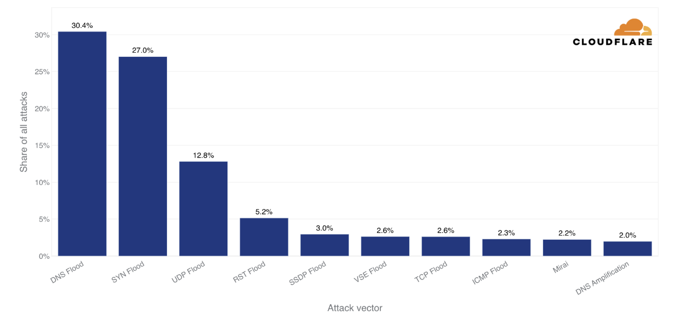

# Network DOS     

_이 프로젝트는 학습 목적으로 실행된 것입니다. 격리된 실습용 VM에서만 사용해주세요. 허가 받지 않은 시스템에 대해서는 절대 실행하지 마세요._

### 실행 환경  
- 취약 dns 서버 :  Alpine Version 3.23.2 (Released Dec 17, 2025)
- 공격 대상 서버 : metasploitable2
- 공격자 서버 : kali linux (2025.1c)
- 사용 가상머신 : Vmare 

Current Alpine Version 3.23.2 (Released Dec 17, 2025)

 

## 개요  
인터넷 서비스는 보안을 잘 갖추고 있어도, 요청이 한꺼번에 몰리면 서비스가 정상적으로 동작하지 않을 수 있습니다.  

이처럼 서버나 네트워크가 감당할 수 있는 양을 넘겨서 서비스가 멈추게 만드는 것을 DOS(Denial of Service)라고 합니다.  

여기서 요청을 보내는 주체가 한 지점이면 DoS,   
여러 위치에서 동시에 요청이 들어오면 DDoS(Distributed Denial of Service)라고 합니다.   

 

<figure style="max-width:780px; margin:0;">
  
  <figcaption style="font-size:0.9rem; color:#666; margin-top:6px;">
    출처: <a href="https://www.cloudflare.com" target="_blank" rel="noopener noreferrer" style="color:#0073e6; text-decoration:none;">Cloudflare</a>,
    The locations most targeted by DDoS attacks for 2025 Q2
  </figcaption>
</figure>
 

Cloudflare의 2025년 2분기 보고서에 따르면,   
대한민국은 전 세계에서 DDoS 공격을 많이 받는 국가 5위로 기록되었습니다.  

DDOS 공격은 우리 주변에서 충분히 자주 발생하는 위협임을 알 수 있습니다.  

 

## 목차    

<figure style="max-width:720px; margin:0;">
  
  <figcaption style="font-size:0.9rem; color:#666; margin-top:6px;">
    출처: Cloudflare — 2025년 2분기 상위 L3/4 DDoS 공격 벡터
  </figcaption>
</figure>
 

위 그래프는 2025년 2분기에 발생한 L3(Network Layer), L4(Transport Layer) 에서의 DDOS 공격 비율입니다.    

이번 레포에서는 상위 3가지 공격 기법인 DNS Flooding, SYN Flooding, UDP Flooding 을 실행시켜보고 대응해보는 실습을 해볼 예정입니다.   

 

- DNS Flood

- TCP SYN Flood

- UDP Flood

 

### 참조   
- https://github.com/rapid7/metasploit-framework/tree/master/modules/auxiliary/dos
- https://blog.cloudflare.com/ddos-threat-report-for-2025-q2