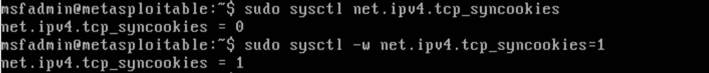
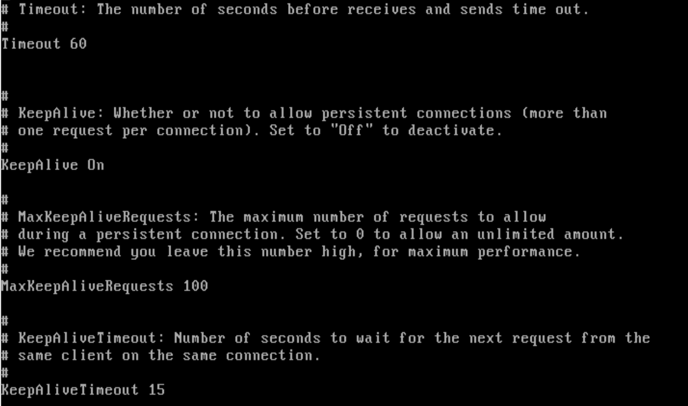

# TCP SYN Flooding 방어 실습


### 공격 대응

- 한국 인터넷 진흥원(KISA)의 DDOS 대응 가이드에는 SYN Flooding 공격에 대응 하는 방법으로 4가지가 기재되어 있습니다.  
  - SYN Cookie 적용
  - TCP 연결유지 시간 조정
  - 임계치 기반 차단
  - First SYN Drop을 적용

<br>
<br>

우선 위 방법들을 통해 간단하게 방어 대책을 마련해보고, 결과를 확인해보겠습니다.  


**1. SYN Cookie 적용**   

SYN 쿠키는 서버가 SYN 패킷 수신 이후, SYN/ACK Packet의 seq 값에 임의의 쿠키 값을 추가하여 대응하는 방법입니다. 이때 쿠키 값은 클라이언트 정보를 암호화한 값입니다. 따로 연결 상태 정보를 저장하지 않으므로 SYN Flooding 공격에 대비할 수 있습니다. 하지만 처리해야 할 쿠키가 많을수록 처리 오버헤드가 증가하고 쿠키 자체에 많은 정보를 저장할 수도 없으므로, 완화 목적으로 주로 사용됩니다.   

<br>

  

설정 방법은 매우 간단합니다.   
<br>

**syn cookies 값 조회**
```bash
sudo sysctl net.ipv4.tcp_syncookies
```
<br>

**syn cookies 값 변경**
```bash
sudo sysctl -w net.ipv4.tcp_syncookies=1
```

**추가 - syn backlog 크기 증가**  
```bash
sudo sysctl -w net.ipv4.tcp_max_syn_backlog=1024
```

추가로 syn backlog의 크기를 증가하는 방법도 있습니다.   

<br>
<br>

**2. TCP 연결유지 시간 조정**   

장시간 열린(이번 실습에서는 반쯤 열린) TCP Connection에 대해 최대 유지시간을 초과하면 해당 세션을 강제료 종료하여 Backlog Queue를 확보하는 방어 기법입니다.   

느린 클라이언트 환경이나 대용량 다운로드 등 정상적인 장기 연결에 대해서도 조기 종료가 될 수 있으므로 서비스 특성에 맞는 설계가 필요합니다.  

<br>

  

```bash
sudo vi /etc/apache2/apache2.conf
```

<br>

- `Timeout` 줄이기
  - timeout 수치를 줄여, 자원을 더 빨리 확보합니다.
  - 단, 정상적으로 처리 시간이 긴 요청의 경우도 생각해본 후 설계해야합니다.

- `KeepAliveTimeout` 줄이기
  - Keep-Alive 연결을 빨리 닫아 동시에 연결되는 수를 줄입니다.
  - 단, 연결 재사용 시간이 짧아지므로 (클라이언트가 새로운 TCP 연결을 자주 만드는 경우에) TCP handshaking 오버헤드가 증가할 수 있음.

- `MaxKeepAliveRequests` 낮추기
  - 한 연결이 너무 많은 요청을 독점하는 것을 방지할 수 있습니다.
  - 단, 정상 클라이언트가 많은 요청을 하나의 연결으로 처리하지 못해 연결 재설정이 늘어날 수 있습니다.

  
  
자신에게 맞는 서버 파일이 존재하는 곳에서 timeout, KeepAliveTimeout와 MaxKeepAliveRequests를 자신의 상황에 맞게 설계하고 수정하면 됩니다.  


<br>
<br>

**3. 임계치 기반 차단**  

대량의 SYN 패킷을 전송하는 IP를 확인하여 임계치를 초과하는 IP를 차단하는 설정을 해두는 방법입니다.    
<br>

| 항목               | 기준 시간 |  임계치 | 차단 시간 |
| ---------------- | ----: | ---: | ----: |
| TCP SYN Flooding |    1초 | 120개 |  300초 |


이러한 방식으로 대량의 SYN 패킷을 보내는 공격자의 IP를 일정 시간동안 차단할 수 있습니다.  

위 방법의 실습은 다음장에서, 방화벽/라우터 역할을 하는 Openwrt 를 구현한 뒤 실습해보겠습니다.  

- Kali(공격자) - OpenWRT - Metasploitable2(공격 대상 서버)

OpenWRT에서 포트포워딩 설정을 간단히 해준 뒤, 방어를 해볼 예정입니다.  


<br>
<br>

**4. First SYN Drop을 적용**  


### Reference  

- KISA, DDOS 공격 대응 가이드 : https://www.krcert.or.kr/kr/bbs/view.do?bbsId=B0000127&nttId=36186&menuNo=205021
