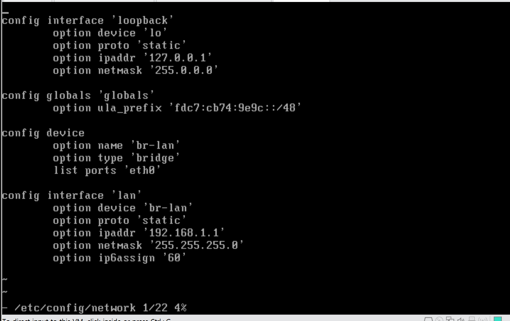
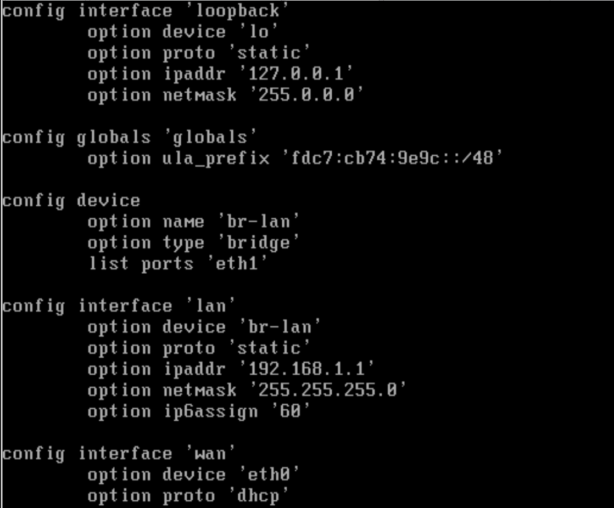
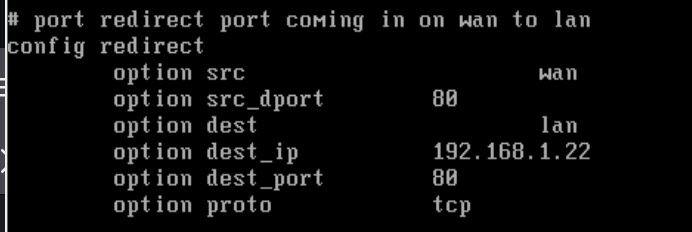
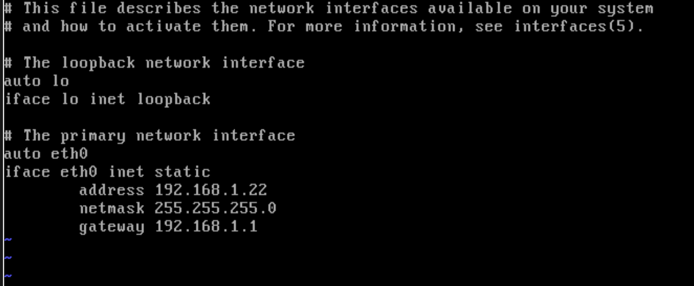
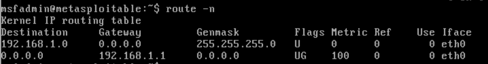
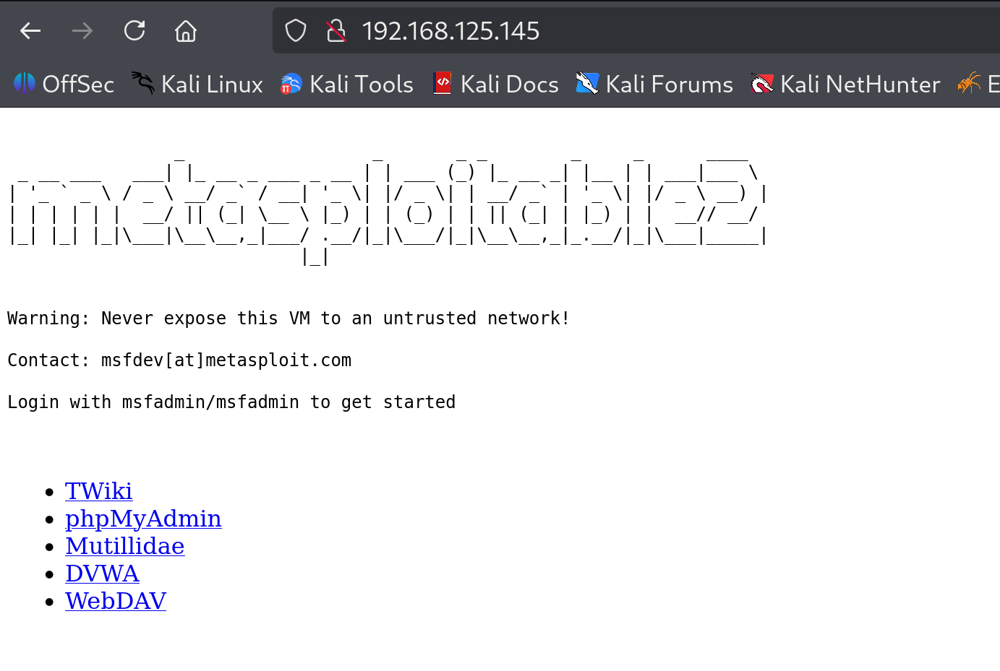

# openwrt 세팅

<br>

### 실행 환경  
- 공격 대상 서버 : metasploitable2
- 라우터 : OpenWRT (24.10.3)
- 공격자 서버 : kali linux (2025.1c)
- 사용 가상머신 : Vmare 


<br>

### 목표 상황 (예시)
```
   kali (공격자) 
         |
       (WAN) 
         |   ip 주소 : 192.168.125.145
 openwrt (라우터/방화벽)
         |   ip 주소 : 192.168.1.1
       (LAN)
         |   ip 주소 : 192.168.1.22
   metasploitable2 
    (공격대상 서버)
```


<br>

### VMare 세팅  

openwrt를 다운받아주고, VM에 올려줍니다.    
<br>

  

openwrt를 방화벽으로 사용하기 위해서, openwrt의 setting 화면에서 Network Adapter를 두개 만들어줍니다.  

**Network Adapter 설정**

```
   kali (공격자) 
         |
       (WAN) 
         |   Network Adapter : NAT
 openwrt (라우터/방화벽)
         |   Network Adapter : Host-only
       (LAN)
         |   Network Adapter : Host-only
   metasploitable2 
    (공격대상 서버)
```

<br>

### openwrt 세팅  


     

그리고 아래 경로 파일을 확인해보면 위 사진과 같이 설정이 되어있습니다.  

```
/etc/config/network
```

<br>



```vbnet
config interface 'loopback'
    option device 'lo'
    option proto 'static'
    option ipaddr '127.0.0.1'
    option netmask '255.0.0.0'

config globals 'globals'
    option ula_prefix 'fdc7:cb74:9e9c::/48'

config device
    option name 'br-lan'
    option type 'bridge'
    list ports 'eth1'

config interface 'lan'
    option device 'br-lan'
    option proto 'static'
    option ipaddr '192.168.1.1'
    option netmask '255.255.255.0'
    option ip6assign '60'

config interface 'wan'
    option device 'eth0'
    option proto 'dhcp'

```

해당 파일을 수정해줍시다.   

LAN으로 묶였던 포트를 eth0에서 eth1로 바꿔주고,  
eth0은 WAN 인터페이스로 사용해줍니다.  


<br>

```bash
/etc/init.d/network restart
```

서비스를 재적용해줍니다.  

<br>

이제 openwrt 주소로 오는 패킷을 내부로 옮겨야하기 때문에 리다이렉트 설정을 바꿔주겠습니다.  



아래 경로의 파일의 하단 근처에 주석 처리된 부분을 일부 수정해주면 됩니다. 실제 metasploitable 주소인 192.168.1.22 로 설정해주었습니다.  

```
/etc/config/firewall
```

```ini
config redirect
    option src 'wan'
    option src_dport 80
    option dest lan
    option dest_ip 192.168.1.22
    option dest_port 80
    option proto tcp
```


또한 추가로 openwrt 에서 제공하는 관리자 페이지를 외부에 공개하지 않기 위해 uhttpd 파일도 수정해줍니다.  


내부 주소에서만 listen 하도록 수정해주었습니다.  

```
/etc/config/uhttpd
```

```
list listen_http '192.168.1.22:80'
list listen_http '[::]:80'
```


이제 적용만 해주면 openwrt 에선 설정이 끝이났습니다.  

```bash
/etc/init.d/firewall restart
/etc/init.d/uhttpd restart
```

<br>

### metasploitable 설정



아래 경로의 파일을 위와 같이 만들어줍니다.   

```bash
/etc/network/interfaces
```

이전에 설정한 openwrt를 게이트웨이로 설정하고,  
고정 ip를 할당받습니다.  


```bash
/etc/init.d/network restart
```

마찬가지로 서비스를 재적용해줍니다.  
 
<br>




잘 적용되었는 것이 확인되었습니다.  


### 적용 확인  



설정이 완료되었다면 해당 주소의 80 포트로 들어가서 연결이 되는지 확인해봅니다.  

여기서 주의할 점은 이전에 주소에서는 브라우저 캐시가 남아있어, 이전 openwrt의 다른 주소(ex. 관리자 페이지)로 넘어갈 가능성이 큽니다. 따라서 시크릿 모드를 사용해 실행해주면 쉽게 올바른 주소로 들어갈 수 있습니다.  


<br>

세팅이 끝났으니 openwrt에서 포워딩 규칙을 설정하고, SYN flood 공격을 방어해보겠습니다.   


<br>
<br>


### 참조

- OpenWRT VMare 다운로드 가이드 : https://openwrt.org/docs/guide-user/virtualization/vmware
- OpenWRT 24.10.3 다운로드 링크 : https://archive.openwrt.org/releases/24.10.3/targets/x86/64/
