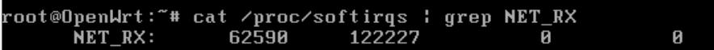
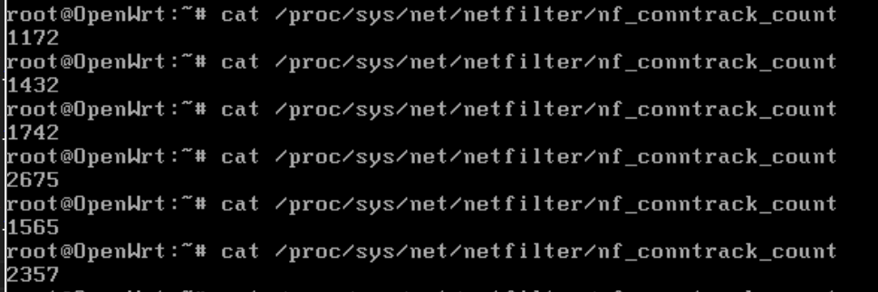
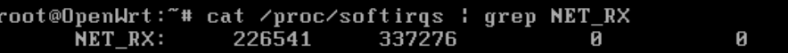
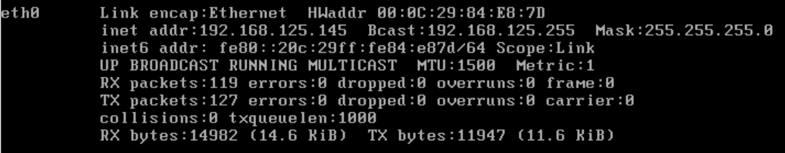
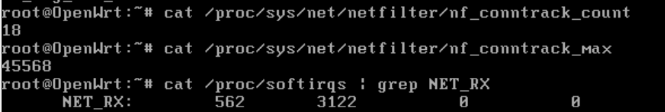

# 임계치 기반 차단: ingress hook & PREROUTING hook 에서 DoS 차단 비교 

### 임계치 기반 차단  

- 기준 시간마다 유입되는 패킷의 양을 정해두고, 이를 넘어서면 DOS 공격으로 간주하여 자동으로 차단하는 방어 기법입니다. 기준은 아래로 설정해보겠습니다.   


| 항목               | 기준 시간 |  임계치 | 차단 시간 |
| ---------------- | ----: | ---: | ----: |
| TCP SYN Flooding |    1초 | 120개 |  300초 |


- 이번 실습은 openwrt에서 진행됩니다. 

- 동일한 DOS 공격 조건에서 차단 위치에 따라 커널 리소스 소모 & CPU 사용 & 시스템 안정성을 검증하는 것이 목표입니다.  

<br>

### 방어 지점 설정  

<figure style="max-width:780px; margin:0;">
  
  <figcaption style="font-size:0.9rem; color:#666; margin-top:6px;">
    출처: <a href="https://thermalcircle.de/doku.php?id=blog:linux:nftables_packet_flow_netfilter_hooks_detail" target="_blank" rel="noopener noreferrer" style="color:#0073e6; text-decoration:none;">Thermalcircle</a>,
    Netfilter hooks - simple block diagram
  </figcaption>
</figure>
<br>

위 그림에서 nftables의 경우 igress 훅이 추가되었습니다. Prerouting 이전에 NIC에서 패킷을 받자마자 실행이 됩니다.   

그말은 곧 커널이 패킷을 이해하기도 전에 진행이된다는 뜻입니다. 즉 최전방에서 DOS를 차단할 수 있으므로, 최소한의 비용으로 좋은 결과를 낼 수 있을 것이라 예상됩니다.  


<br>

방어지점은 아래와 같습니다. 
  - (1) 아무것도 막지 않음 
  - (2) PREROUTING 에서 차단
  - (2) ingress 에서 차단


<br>

### 공통 조건 & 실험 방법

- openwrt에서 `cat /proc/softirqs | grep NET_RX`로 네트워크 수신 경로에서 처리되는 softirq (software interrupt request) 누적 카운터를 확인해볼 것입니다.  
  - 해당 값이 클수록 수신 처리를 더 많이 수행했다는 뜻입니다. 
- `nf_conntrack` 의 개수를 세어보아 현재 conntrack가 가지고 있는 연결의 개수의 차이를 비교해볼 것입니다.  
  - 해당 값이 클수록 많은 네트워크 요청이 진행 중인 것입니다.

<br>

### 1. 아무런 방어 조치도 취하지 않은 상태

**초기 상태**


**20초~50초 사이 5초 간격 상태**


**60초 간 실행 후 상태**
  


<br>

**상태 설명**   

softirq 처리 : 62548 / 121940  
conntrack : 10000 이상  

방어가 없는 상태에서는 공격트래픽이 그대로 커널로 들어와서 `nf_conntrack`의 수가 10000대로 매우 큰 것을 확인해볼 수 있습니다. 이는 아무런 방어조치도 취하지 않았기 때문에 반만 열린 연결들이, 커널의 conntrack에 유지되고 있기 때문입니다.  

softirq 처리 수는 두 번째 값이 엄청 크게 증가한 것이 보입니다.  
 
<br>

### 2. PREROUTING에서 방어

우선 테이블을 만들고 prerouting 체인을 생성해줍니다.  

```sh
nft add table inet syn_test1
nft add chain inet syn_test1 prerouting { type filter hook prerouting priority -300 \; }
```

이제 차단 룰을 추가해줍니다.  

```sh
nft add rule inet syn_test1 prerouting 'tcp flags & (syn|ack) == syn limit rate over 120/second drop'
```

확인은 아래처럼 확인 가능합니다.  

```sh
nft list chain inet syn_test1 prerouting
```


**초기 상태**
  

**20초~50초 사이 5초 간격 상태**


**60초 간 실행 후 상태**



<br>

**상태 설명**  
softirq 처리 : 68471 / 79484   
conntrack : 1200~2600 반복 (평균 약 1820)    

`nf_conntrack`의 수가 이전 방법에 비해 약 8배가량 낮아진 것을 볼 수 있습니다. PREROUTING 훅에서 적용한 룰은 1초당 120개를 초과하는 SYN 패킷은 드롭하도록 했기 때문에, 반만 열린 연결은 PREROUTING에서 초과분을 전부 drop 시키게 됩니다. 따라서 conntrack 의 수를 줄이는 것에는 큰 효과를 발휘했습을 보입니다.  

softirq 처리 수의 경우에는 종합하면 약 35000 정도, 방어 없음 경우에 비해 낮은 것을 확인할 수 있습니다.  


<br>

### 3. ingress에서 방어



우선 ifconfig 를 통해 WAN 인터페이스를 알아둡니다. 

eth0 인 것을 확인했으니, eth0 기준으로 룰을 적어봅시다.  

우선 테이블을 만들고, igress 체인을 생성해줍니다.  

```sh
nft add table inet syn_test2
nft add chain inet syn_test2 ingress_guard { type filter hook ingress device eth0 priority -500 \; }
```

이제 차단 룰을 추가해줍니다.  

```sh
nft add rule inet syn_test2 ingress_guard 'tcp flags & (syn|ack) == syn limit rate over 120/second drop'

```

확인은 아래처럼 확인 가능합니다.  

```sh
nft list chain inet syn_test2 ingress_guard
```

  

전에 만들어둔 syn_test1 테이블은 삭제해주고, 해당룰만 적용되어있음을 확인해줍니다.    

**초기 상태**
   


**20초~50초 사이 5초 간격 상태**


**60초 간 실행 후 상태**


<br>

**상태 설명**  
softirq 처리 : 65968 / 76291  
conntrack : 1400~2200 (평균 약 1780)   

ingress 훅에서도 마찬가지로 SYN 임계치를 설정해두고 drop하는 규칙을 적용했습니다. 이전 경우와 마찬가지로 SYN 패킷의 초과분을 drop 했으므로 `nf_conntrack` 의 수가 방어 없음에 비해 훨씬 더 적은 것을 확인할 수 있습니다.  


softirq의 경우에도 방어 없음에 비해 약 40000 가량 낮은 것을 확인해볼 수 있습니다.  


<br>


### 종합 결론  

방어가 없을 때와 나머지 두 방법을 비교했을 때는 방어를 적용한 경우가 conntrack의 수와, 패킷 처리량 모두가 더욱 작은 것이 명확하게 확인됩니다.  


다만, PREROUTING과 ingress를 비교해보면, 방어없음과 비교했을 때와는 다르게 명확한 차이를 보이지는 않습니다.  

물론 ingress 방식이 PREROUTING에 비해 `nf_conntrack`의 수의 변동폭이 작아 더욱 안정적으로 보이긴하지만, 전체 개수는 큰 차이가 없습니다. softirq 또한 눈에 띄게 적은 수를 가지고 있지도 않습니다.  

이는 단 6번의 결과만으로, 비교적 짧은 시간동안 적은 수의 측정 결과를 기반으로 하고 있기 때문에 그런 것입니다. 따라서 위 결과만을 통해 ingress가 더 안정적이다는 결론으로 가기에는 다소 무리가 있어보입니다.   

하지만 거의 동일한 시간에서 나온 결과임을 고려해보면, `nf_conntrack`의 수가 비슷하지만 더 작다는 점, 변동이 더욱 작다는 점은 유의미한 결과임을 강조하고 싶습니다.   

이는 ingress 훅에서 패킷이 이른 시점에 drop 되기 때문에 conntrack 테이블에 새로운 연결들이 유지되는 빈도가 일정하기 때문이라 해석할 수 있습니다. ingress 방어는 conntrack 의 수를 극적으로 줄이기보다는 불필요한 연결 시도를 더욱 빠르게 제한함으로써 안정적인 범위로 유지하는 것에는 강점이 있다고 해석이 가능합니다.   


<br>
<br>

### 참조

- netfilter hooks : https://thermalcircle.de/doku.php?id=blog:linux:nftables_packet_flow_netfilter_hooks_detail
- conntrack : https://blog.cloudflare.com/conntrack-turns-a-blind-eye-to-dropped-syns/