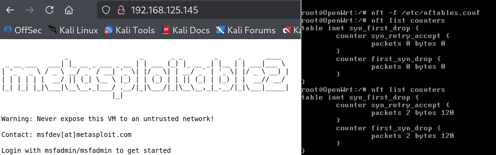
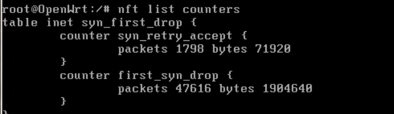
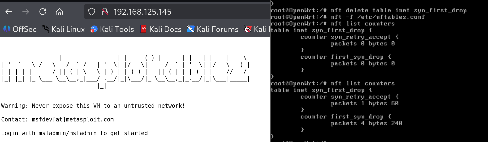
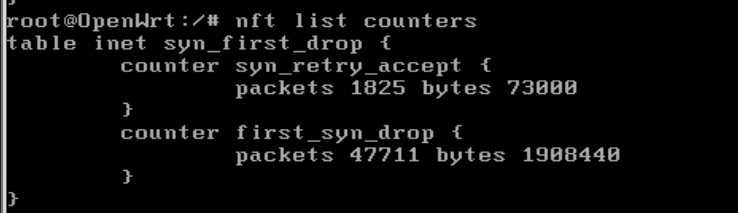
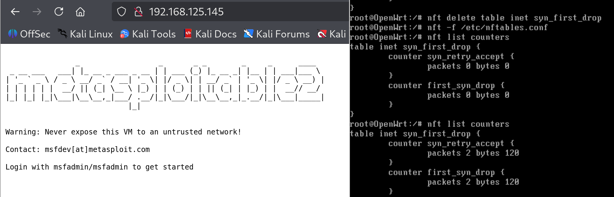
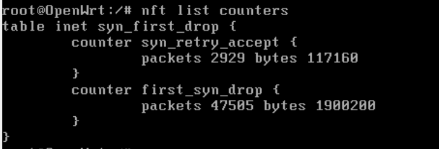

# timeout 값 변화에 따른 SYN First Drop 방어 성능 영향 분석


### First SYN Drop   
- 처음 온 연결 요청은 버리고 다음 연결부터 받는 방법입니다.  
- SYN flooding의 경우 가짜 주소로 수많은 SYN 패킷만을 보내므로 가짜 요청을 걸리내기 위한 방어기법입니다.  

<br>

### hook 위치 & 선택이유  
PREROUTING hook을 사용할 예정입니다.   

SYN flood와 같이 대량의 패킷이 유입되는 공격을 조기에 차단하고 conntrack 테이블의 불필요한 부하를 최소화하고,
timeout 값에 따른 변화를 관찰하기 위해서 입니다.  

또한 PREROUTING은 conntrack의 시작점이므로 (nf_conntack_in 함수로 시작) 타임아웃 설정을 변경하여 그 영향을 측정한다면 지연시간의 왜곡을 줄일 수 있습니다.   

<br>

### 실험 방법   
- `timeout` 값을 바꿔가며 실험을 진행합니다.  
- SYN 패킷은 1분간 전송합니다.  
- 이때 패킷을 받아들인 횟수와 drop한 횟수를 세어보며 

<br>

### 


```
vi /etc/nftables.d/syn_first_drop.nft
```


```nft
table inet syn_first_drop {
    set syn_seen {
        type ipv4_addr . inet_service . inet_service
        flags timeout
    }

    counter syn_retry_accept {}
    counter first_syn_drop {}

    chain preraw {
        type filter hook prerouting priority -300; policy accept;

        ip daddr 192.168.125.145 tcp flags & (syn|ack|rst) == syn ip saddr . tcp sport . tcp dport @syn_seen counter name "syn_retry_accept" accept
        ip daddr 192.168.125.145 tcp flags & (syn|ack|rst) == syn add @syn_seen { ip saddr . tcp sport . tcp dport timeout 1s } counter name "first_syn_drop" drop
    }
}
```


```sh
nft list counters
nft reset counters
```











```
nft delete table inet syn_first_drop
nft -f /etc/nftables.conf
```







개수만 늘어나고 큰 차이는 없음
임계치 + 포트 합쳐서 쓰는게 좋을듯?