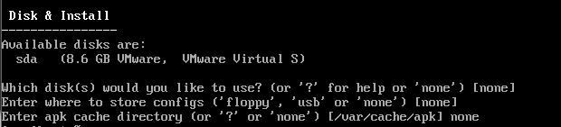
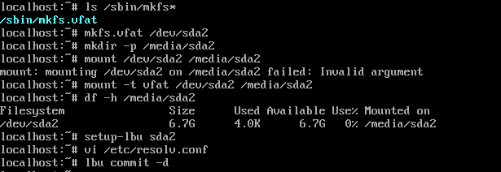

# DNS Flooding 공격 실습 

### DNS Flooding 개념  

- DNS Flooding은 서버 자원이나 대역폭을 고갈시키는 방법 중 하나입니다.  
- DNS 프로토콜을 이용하여 대량의 질의 트래픽을 발생시켜서 서비스 가용성을 저하시키는 공격입니다.
- 일반적으로 UDP 기반으로 동작하며, UDP의 특성상 대량의 요청을 낮은 비용으로 전송이 가능합니다. 하지만 서버에서는 각 질의에 대해 비싼 처리가 필요한 경우, 서버측의 자원이 크게 소모될 수 있습니다.  
- DNS Query Flood와 DNS Reflection로 두가지 유형을 나누어서 소개하겠습니다. 

<br>

### DNS Flooding DDOS 공격 종류    
- DNS Query Flooding
    - 자원 소진 공격에 해당하며, 
    - DNS 서버에 대량의 DNS 질의를 보내서 정상 서비스를 할 수 없게 만드는 공격입니다. 
    - 공격자는 주로 다수의 봇넷을 활용하며, 짧은 시간동안 대량의 DNS 질의를 보내므로 자원이 소모되었다면 정상 사용자의 질의에 응답하지 못하게 됩니다. 

- DNS Reflection Attack
    - DRDoS 공격이며, 대역폭 공격에 해당합니다.
    - 출발지 ip를 공격 대상 피해자 ip 주소로 위조하여 dns 서버에 질의를 보냅니다. 
    - 해당 서버들이 생성한 대용량 응답은 피해자에게 전송이 되며 이로 인해 피해자의 대역폭을 고갈시키게 됩니다.
    - 응답 크기를 극대화하기 위해 DNS 서버의 모든 레코드를 요청하는 ANY 타입 질의를 사용하며, DNS 서버는 요청받은 패킷에 대해 증폭된 응답을 피해자에게 전달합니다.  

<br>

### DNS 서버 구성 - Alpine Linux 세팅

이번 실습에서는 dns 서버를 활용할 예정이므로, 간단한 DNS 서버를 Alpine 리눅스를 활용하여 만들어주겠습니다.    

- 다운 버전 : Alpine Extended Version 3.23.2 (Released Dec 17, 2025)

<br>

위 버전을 다운로드한 후 VMare에 올려주었습니다.  
login에서 비밀번호 입력없이 root만 입력하면 세팅화면으로 넘어가게 됩니다.  

고정 ip와 디스크 할당 외엔 대부분 엔터를 입력했습니다.  


```
setup-alpine
```

<br>

**고정 ip 할당**  


192.168.125.10으로 고정 ip를 할당해주었습니다.  


<br>

  

alpine 리눅스는 RAM 기반으로 동작해서 디스크를 사용하지 않습니다. 따라서 설정 환경을 지속적으로 쓰기 위해서는 별도의 디스크 설정을 해주어야합니다.   

또한 지금 환경에서는 네트워크에 연결시키지 않은 폐쇄환경이기 때문에 패키지 설치나 부트로더 구성을 위한 온라인 저장소를 사용할 수 없습니다. 따라서 위 사진에 보이는 저 8.6GB의 sda 디스크를 수동으로 설정을 저장하는 곳으로 사용하도록 설정하겠습니다.  

<br>

  

그러기 위해서는 포맷 도구를 사용해야하는데, 현재 어떤 명령어를 사용할 수 있는지확인해보았습니다.  

mkfs.vfat을 사용할 수 있는 걸 알았으므로 sda2 파티션을 포맷해줍니다.  

이제 `/media/sda2` 디렉토리를 만들어주고, 아까 만들어둔 파일시스템을 해당 경로에 마운트 해주면 됩니다.  

```sh
$ ls /sbin/mkfs*
$ mkfs.vfat /dev/sda2
$ mkdir -p /media/sda2
$ mount /dev/sda2 /media/sda2
```

`/media/sda2`가 잘 붙었는지 확인은 `df -h` 명령어로 확인이 가능합니다.  

<br>

이제 sda2를 백업 저장소처럼 사용할 것이므로 백업 저장소로 지정을 해주고,  

DNS 설정파일에 적힌 값도 확인해보고 변경사항을 하드 디스크에 저장해줍니다.  

```sh
$ setup-lbu sda2
$ vi /etc/resolv.conf
$ lbu commit -d
```
<br>

현재 alpine linux는 RAM에서만 돌아가기 때문에 현재의 설정들을 `/media/sda2`에 `localhost.apkovl.tar.gz` 로 저장하는 것입니다. 위 방법을 통해 다음 부팅 때에도 자동으로 설정을 복구할 수 있게 됩니다.  

`ls -l /media/sda2`를 통해 해당 압축파일이 생겼는지 확인해볼 수 있습니다.  


<br>


```sh
reboot
```

실제로 reboot을 해본 뒤 설정을 확인해봐도 초기화가 되지 않은 것을 확인할 수 있습니다.  

<br>

### DNS 구성


<br>
<br>


### Reference  
- UDP Flooding 공격 : https://www.cloudflare.com/ko-kr/learning/ddos/udp-flood-ddos-attack/

- 자료:한국인터넷진흥원(KISA) DDOS 공격대응 가이드 : https://www.krcert.or.kr/kr/bbs/view.do?bbsId=B0000127&nttId=36186&menuNo=205021


- alpine linux download : https://www.alpinelinux.org/downloads/

